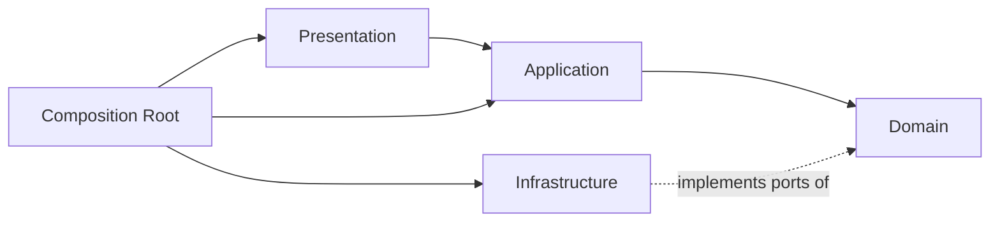
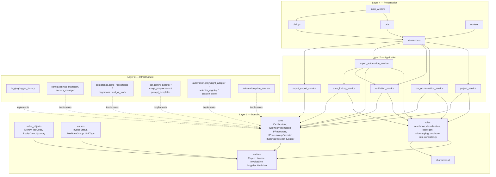
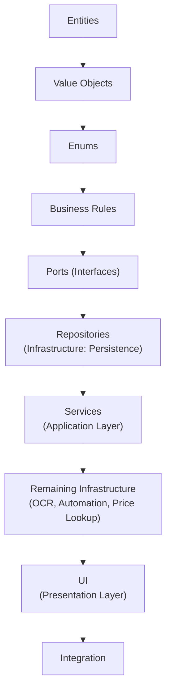
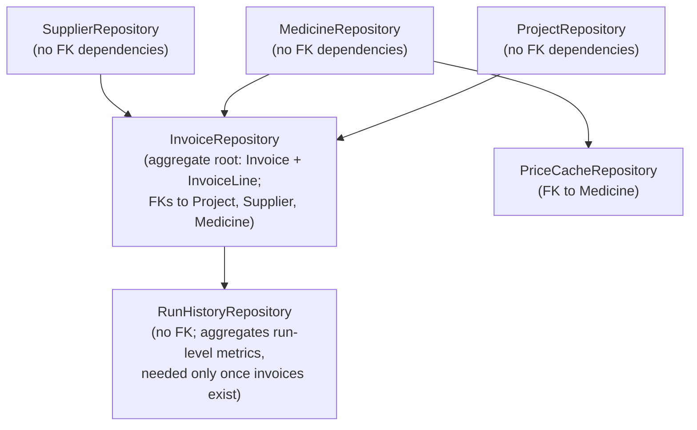
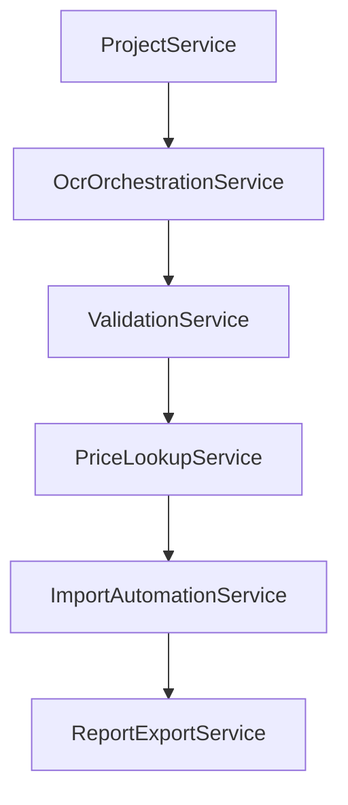
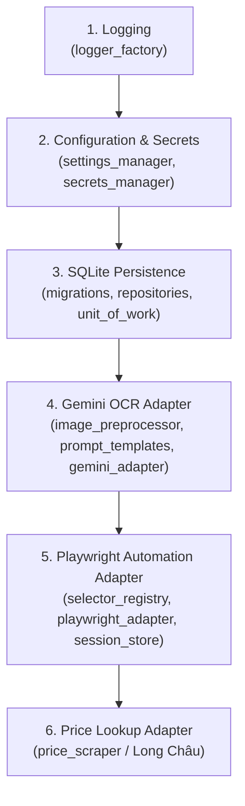
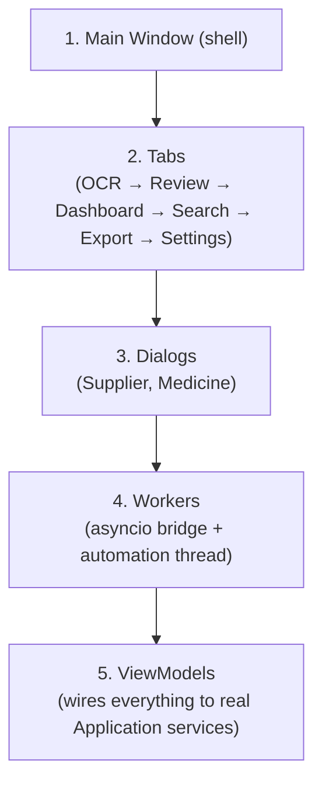

# Implementation Blueprint & Development Plan
# Pharmacy Purchase Invoice Automation System

## Document Control

| Field | Value |
|---|---|
| Project | Automated Import of Pharmacy Purchase Invoices into webnhathuoc.com |
| Phase | Implementation Planning — **no code, no architectural redesign** |
| Prepared as | Principal Software Architect / Senior Python Engineer / Tech Lead / Clean Architecture & DDD Expert / Playwright Expert / OCR System Architect / Desktop Application Architect |
| Date | July 26, 2026 |
| Status | Draft v1.0 — Implementation Blueprint |
| Upstream document | *Technical Design Document — Pharmacy Purchase Invoice Automation System* (v1.0, approved). Every module name, layer boundary, port, entity, and folder path used below is taken verbatim from that document. |

## Table of Contents

1. Project Overview
2. Implementation Phases
3. Dependency Graph
4. Module Order
5. Repository Order
6. Service Order
7. Infrastructure Order
8. UI Order
9. Testing Strategy
10. Milestones
11. Final Development Checklist

---

## 1. Project Overview

### 1.1 Purpose of This Document

The Technical Design Document (TDD) answered *what* the system is and *why* it is shaped the way it is. This document answers *in what order* it gets built, so that implementation can proceed — by this AI, a future AI, or a human engineer — **without re-opening a single architectural decision**.

Every module referenced below already exists as a named concept in the TDD (§2–§12). This blueprint does not introduce, rename, remove, or restructure any module, layer, entity, port, or table. Where the source prompt's own examples suggested an order that conflicts with Clean Architecture's dependency rule or with the entity relationships defined in the TDD's schema (§12.5), this document resolves the conflict explicitly and states the reasoning — that resolution *is* the value of this blueprint: no ambiguity is left for whoever implements it.

### 1.2 How to Use This Document

- Read top to bottom. Each numbered section assumes every prior section is complete.
- §2 (Implementation Phases) is the coarse-grained roadmap. §4–§8 refine each phase into a precise build order for domain modules, repositories, services, infrastructure adapters, and UI components.
- §11 (Final Development Checklist) is the literal, linear execution list. If in doubt about "what do I build next," §11 is the answer; every other section exists to justify why that checklist is in that order.
- Nothing in this document should be read as permission to simplify, merge, or skip a layer boundary established in the TDD, even if a shortcut appears tempting during implementation.

### 1.3 Relationship to the TDD's Own Roadmap

The TDD's §17 roadmap (Phases 0–9) was expressed at the level of **user-facing capability** ("a user can select a folder and run OCR," "a full batch imports end-to-end"). This blueprint's §2 roadmap (Phases 1–8) is expressed at the level of **build sequence** — it is a refinement, not a replacement:

| Blueprint Phase | Corresponds to TDD Phase(s) |
|---|---|
| 1. Core Domain | Part of TDD Phase 1 (Foundation) |
| 2. Infrastructure Foundation | Remainder of TDD Phase 1 (Foundation) |
| 3. OCR Engine | TDD Phase 2 (OCR Pipeline) |
| 4. Automation Engine | TDD Phase 4 (Automation Engine) |
| 5. Desktop UI | TDD Phase 3 (Desktop UI Shell) |
| 6. Integration | TDD Phase 5 (Full Pipeline Integration) + Phase 6 (Price Lookup, Export & Reporting) |
| 7. Testing | Formalizes testing activity that runs continuously but is consolidated and gated here, ahead of TDD Phase 7 (Hardening) |
| 8. Production Hardening | TDD Phase 7 (Hardening) + Phase 8 (Pilot & UAT), leading into TDD Phase 9 (Production Rollout) |

---

## 2. Implementation Phases

Each phase below states **Purpose**, **Deliverables**, **Dependencies**, **Risks** (across the six required risk categories), and **Exit Criteria**.

### Phase 1 — Core Domain

**Purpose.** Establish the innermost layer — the one everything else depends on, and which itself depends on nothing outside itself. This is the single most consequential phase: every port signature frozen here is a contract every later phase must honor without renegotiation.

**Deliverables.**
- Entities: `Project`, `Invoice`, `InvoiceLine`, `Supplier`, `Medicine`.
- Value Objects: `Money`, `TaxCode`, `ExpiryDate`, `Quantity`.
- Enums: `InvoiceStatus`, `MedicineGroup`, `UnitType`.
- Business rule validators (`domain.rules`): supplier resolution, medicine resolution, prescription/OTC classification, medicine-code sequencing (`TH1`, `TH2`, …), unit mapping (`viên` / `tuýp`), duplicate detection, invoice-total consistency.
- Port interfaces (`domain.ports`): `IOcrProvider`, `IBrowserAutomation`, `IInvoiceRepository`, `ISupplierRepository`, `IMedicineRepository`, `IProjectRepository`, `IPriceLookupProvider`, `ISettingsProvider`, `ILogger`.
- `shared.result` — the `Result`/`Outcome` type, needed immediately because domain rules return it (per TDD §13.1).

**Dependencies.** None — first phase.

**Risks.**

| Category | Risk | Mitigation |
|---|---|---|
| Blockers | None expected; this phase has no external dependency. | N/A |
| Hidden Dependencies | A port signature that looks "obviously right" in isolation but doesn't fit how a later Infrastructure adapter actually needs to be called. | Every port signature is cross-checked against §7–§8's concrete adapter descriptions *before* being frozen, not after. |
| Technical Debt | Under-specifying a value object (e.g., `Money` without currency/rounding rules) forces rework once real invoice data arrives. | Value objects are specified with their invariants explicitly, not left as thin wrappers. |
| Architecture | Any accidental import from `application`, `infrastructure`, or `presentation` into `domain` silently breaks the dependency rule. | Enforced by code review discipline and, later, an import-linter rule added in Phase 7. |
| Performance | None material — this layer has no I/O. | N/A |
| Security | None material — no secrets or external calls exist at this layer. | N/A |

**Exit Criteria.** Every domain rule has passing unit tests. Every port interface is reviewed against every later phase's adapter needs and then frozen. No `domain` module imports anything from an outer layer.

---

### Phase 2 — Infrastructure Foundation

**Purpose.** Stand up the cross-cutting infrastructure that every later capability needs before it can do anything useful: logging, configuration/secrets, and persistence.

**Deliverables.**
- `infrastructure.logging.logger_factory` — per-category loggers, rotation, redaction (TDD §11).
- `infrastructure.config.settings_manager` + `infrastructure.config.secrets_manager` — layered settings, encrypted secret storage (TDD §10, §15).
- `infrastructure.persistence.migrations` — versioned schema migrations (TDD §12.7).
- `infrastructure.persistence.sqlite_repositories` — all repository implementations (order resolved in §5 below).
- `infrastructure.persistence.unit_of_work`.

**Dependencies.** Phase 1 (repositories implement `domain.ports` and operate on Phase-1 entities).

**Risks.**

| Category | Risk | Mitigation |
|---|---|---|
| Blockers | A frozen Phase-1 port turns out to be awkward to implement against SQLite. | Port review step from Phase 1 exit criteria specifically targets this. |
| Hidden Dependencies | Settings must exist before Secrets, but Secrets must exist before any *real* Settings value (API key, credentials) can be safely stored — a circular-feeling dependency. | Resolved explicitly in §7: `secrets_manager` is built as a thin, independent primitive first; `settings_manager` composes it. |
| Technical Debt | Skipping migrations in favor of "just create the tables once" breaks upgrade paths later. | Migrations are mandatory from the first schema version, not retrofitted. |
| Architecture | A repository accidentally leaking SQLite-specific types (e.g., raw cursor rows) back into `domain` or `application`. | Repositories return `domain` entities/value objects only, never raw driver types. |
| Performance | Missing indexes (TDD §12.6) discovered only once Search (FR-12) is built in Phase 5. | Indexes are created in the *first* migration, not added reactively. |
| Security | Secrets accidentally logged during repository/adapter debugging. | Redaction filter (TDD §11.3) is built and verified in this phase, before any secret-handling code exists to leak through it. |

**Exit Criteria.** Every repository passes integration tests against a real (test) SQLite file. Settings correctly layer defaults → file → env → UI-set values. No secret appears in plaintext in any log, test artifact, or the settings file itself. Logging categories exactly match `pharmacy_automation.ocr`, `.gemini_api`, `.automation`, `.database`, `.error`, `.retry` (TDD §11.1).

---

### Phase 3 — OCR Engine

**Purpose.** Build image preprocessing, the Gemini adapter, prompt templates, and the normalization/confidence pipeline as a **standalone, headless capability** — testable entirely without a UI, using the golden-file test set.

**Deliverables.**
- `infrastructure.ocr.image_preprocessor` (OpenCV/Pillow: rotate, deskew, crop, denoise, contrast).
- `infrastructure.ocr.prompt_templates` (versioned Gemini prompts + JSON schema).
- `infrastructure.ocr.gemini_adapter` (implements `IOcrProvider`; normalization, confidence scoring, retry policy at the adapter level — TDD §7).
- `application.ocr_orchestration_service`.

**Dependencies.** Phase 1 (`IOcrProvider`, `Invoice`/`InvoiceLine` entities), Phase 2 (`InvoiceRepository` to persist every result immediately; `logger_factory`; `settings_manager` for API key, concurrency limit, retry count).

**Risks.**

| Category | Risk | Mitigation |
|---|---|---|
| Blockers | Gemini API access/quota not yet provisioned when this phase starts. | Provision and smoke-test API access as the very first task of this phase, before any adapter code is written. |
| Hidden Dependencies | The confidence-scoring heuristic (sum of line totals vs. grand total) implicitly depends on `Money` value-object rounding rules from Phase 1. | Cross-checked explicitly against the Phase-1 `Money` specification before implementation. |
| Technical Debt | Hardcoding prompt text inline instead of in versioned template files. | Prompt templates are files from day one (TDD §7.3), never string literals in adapter code. |
| Architecture | Letting Gemini's raw response shape leak past the adapter boundary into `application`. | The adapter is the *only* place that ever sees raw Gemini JSON; everything past it is a normalized domain-shaped result. |
| Performance | Unbounded concurrency exhausting Gemini quota during early testing. | Concurrency limit setting (TDD §10.2) is enforced from the first integration test, not left unbounded "for now." |
| Security | API key present in test fixtures or committed prompt-template files. | Secrets never appear in template files; templates only ever *reference* a setting key, never a value. |

**Exit Criteria.** OCR golden-file tests (curated clean / skewed / low-quality / multi-line samples) pass at the agreed accuracy threshold. Every OCR result — success or failure — is persisted immediately; no code path holds a result only in memory. Retry/backoff verified against simulated transient failures (timeout, 5xx, rate limit).

---

### Phase 4 — Automation Engine

**Purpose.** Build the Playwright-driven website automation as a **standalone, headless capability**: browser/session lifecycle, the externalized Selector Registry, the four workflows (Login, Open Import Invoice, Create Supplier, Create Medicine) plus Fill & Save, and the Long Châu price lookup.

**Deliverables.**
- `infrastructure.automation.selector_registry` (both `webnhathuoc.com` and Long Châu configs).
- `infrastructure.automation.session_store` (encrypted `storage_state`).
- `infrastructure.automation.playwright_adapter` (implements `IBrowserAutomation`; workflows, popup/dialog handlers, wait strategy — TDD §8).
- `infrastructure.automation.price_scraper` (implements `IPriceLookupProvider`).
- `application.import_automation_service`, `application.price_lookup_service`.
- Wiring of the Phase-1 supplier/medicine resolution rules into the automation flow.

**Dependencies.** Phase 1 (`IBrowserAutomation`, `IPriceLookupProvider`, domain rules), Phase 2 (repositories; `settings_manager` for credentials/timeouts/headless mode; `secrets_manager`). Phase 3 is *not* a hard dependency — this phase can be built in parallel by a different engineer once Phase 1–2 are frozen — but end-to-end manual testing is easier once Phase 3 supplies real invoice data to automate against.

**Risks.**

| Category | Risk | Mitigation |
|---|---|---|
| Blockers | No staging environment available for `webnhathuoc.com` to test against safely. | Escalated immediately; workflows are validated against recorded HTML fixtures in the interim (TDD §16). |
| Hidden Dependencies | The "Create Medicine" workflow's field list implicitly depends on the exact `Medicine` entity shape frozen in Phase 1 (group, unit, specification). | Cross-checked against the Phase-1 entity before the popup-filling workflow is finalized. |
| Technical Debt | Inlining a selector "just this once" to unblock a demo. | Explicitly disallowed — every locator, without exception, goes through the Selector Registry from the first workflow onward (Coding Rule: "Không hardcode selector"). |
| Architecture | Automation code calling a repository directly instead of going through `application.import_automation_service`. | Automation adapter only ever receives data already resolved by the Application layer; it never queries persistence on its own. |
| Performance | Attempting parallel browser sessions to "go faster." | Explicitly disallowed by design (TDD §8.1, §14.1) — sequential, single-session automation is the architecture, not a temporary limitation. |
| Security | `storage_state` written to disk unencrypted during development "temporarily." | `session_store` encryption is built and verified before the first real login is ever performed, not after. |

**Exit Criteria.** Each of the five workflows (Login, Open Import Invoice, Create Supplier, Create Medicine, Fill & Save) independently validated against staging or fixture HTML. Selector smoke test passes for every registry entry. Session resume after a simulated browser crash verified. Price-cache TTL behavior verified.

---

### Phase 5 — Desktop UI

**Purpose.** Build the PySide6 presentation layer — shell, tabs, dialogs, workers, view models, theming — wiring user interaction to the Application services already built in Phases 3–4.

**Deliverables.**
- `presentation.main_window`.
- All six tabs: `ocr_tab`, `review_tab`, `dashboard_tab`, `search_tab`, `export_tab`, `settings_tab`.
- `presentation.dialogs`: `supplier_dialog`, `medicine_dialog`.
- `presentation.workers` (asyncio bridge for OCR concurrency + dedicated automation thread).
- `presentation.viewmodels` (one per tab/dialog).
- `presentation.theme` (dark-mode QSS).

**Dependencies.** Phase 1 (entities/DTOs surfaced to the UI), Phase 2 (`settings_tab` needs `settings_manager`/`secrets_manager`), Phase 3 (`ocr_tab` needs `ocr_orchestration_service`), Phase 4 (`review_tab`/`dashboard_tab` need `validation_service` and `import_automation_service` — see §6 for why `validation_service` is available by this point).

**Risks.**

| Category | Risk | Mitigation |
|---|---|---|
| Blockers | None expected — all backing services already exist by this phase. | N/A |
| Hidden Dependencies | The Review tab's edit form implicitly depends on every editable field named in FR-05, which must match the `InvoiceLine` value objects exactly. | Field list cross-checked against Phase-1 entities before the form is built. |
| Technical Debt | Putting business logic (e.g., duplicate checks) directly in a ViewModel "to save time." | ViewModels only ever call Application services; they never re-implement a rule that already exists in `domain.rules`. |
| Architecture | A View reaching past its ViewModel to call an Application service or repository directly. | Views bind to ViewModels exclusively (TDD §9.2); enforced by review. |
| Performance | Large invoice lists (500–1,000+) rendered without virtualization, causing UI lag. | Virtualized list widgets (TDD §14.3) are the default from the first tab built, not an optimization added later. |
| Security | Settings tab briefly displaying a password/API key in plaintext during development. | Masked fields (TDD §15.1) are implemented as part of the base widget, not toggled on later. |

**Exit Criteria.** A user can complete the full FR-04/FR-05 review-and-edit loop entirely through the UI, with every edit saved immediately. Start/Pause/Resume/Stop verified against both the OCR worker and the automation worker. Dark theme renders correctly across every tab and dialog.

---

### Phase 6 — Integration

**Purpose.** Wire every previously standalone capability into the single, coherent end-to-end pipeline described in TDD §6 (Data Flow): folder selection → OCR → review → validation → automation → dashboard/reports — including resume-after-restart.

**Deliverables.**
- Composition Root wiring: every concrete Infrastructure adapter bound to its `domain.ports` interface, and every Application service constructed with its real dependencies (TDD §2.2's dependency-injection point).
- Event bus connecting cross-tab updates (`InvoiceOcrCompleted`, `InvoiceImported`, `InvoiceFailed`).
- Resume-on-startup logic (FR-15).
- `application.report_export_service` wired to real, end-to-end data (FR-11, FR-13, FR-16).

**Dependencies.** Phases 1–5, all complete.

**Risks.**

| Category | Risk | Mitigation |
|---|---|---|
| Blockers | A Phase 1–5 module that passed its own isolated tests but was never exercised against another module's real (not fake) implementation. | Integration tests in this phase intentionally use every *real* adapter together for the first time — this phase exists specifically to surface that class of issue. |
| Hidden Dependencies | Dashboard counters (FR-11) implicitly depend on every status transition across OCR, review, and automation being written consistently — a gap in any one stage silently under/over-counts. | Dashboard queries are validated against the full `InvoiceStatus` state machine (TDD §12.4), not just the happy path. |
| Technical Debt | "Temporary" direct wiring between two services that bypasses the Composition Root to get integration working faster. | All wiring goes through the Composition Root without exception — this is the one phase where the temptation is highest and the discipline matters most. |
| Architecture | Cross-tab event bus becoming a backdoor for layer-violating communication (e.g., a View directly mutating another tab's state). | Events carry only domain-level facts (status changes), never UI state. |
| Performance | End-to-end batch of even a modest size (20–50 invoices) revealing a bottleneck invisible in any single phase's isolated testing. | This phase's exit criteria explicitly require running such a batch, not just unit-level integration checks. |
| Security | Resume-on-startup logic inadvertently reloading a stale, unencrypted session state left over from earlier phase testing. | Session state loading always goes through `secrets_manager`/`session_store`, never a raw file read added "just for this phase." |

**Exit Criteria.** A batch of 20–50 real sample invoices flows from image to saved website invoice with only human review in between. Closing and reopening the app mid-batch resumes correctly without reprocessing completed invoices (FR-15 verified end-to-end, not just at the repository level).

---

### Phase 7 — Testing

**Purpose.** Formalize and complete the full test pyramid across every phase's deliverables, closing any test debt accumulated during rapid phase-by-phase development, before hardening begins.

**Deliverables.**
- Full unit test suite (domain + application, per TDD §16).
- Full OCR golden-file suite, versioned alongside prompt templates.
- Full automation test suite (staging + fixture-based) and the scheduled selector smoke test.
- Full UI (`pytest-qt`-style) suite.
- Integration test suite covering the Phase-6 end-to-end pipeline.
- First formal load test (500 and 1,000+ simulated invoices).
- Regression suite consolidating all of the above, wired into CI.

**Dependencies.** Phases 1–6.

**Risks.**

| Category | Risk | Mitigation |
|---|---|---|
| Blockers | Load testing requires a realistic staging environment or a safe way to simulate 1,000+ automation runs without hammering the real production site. | A recorded/fixture-based automation mode is used for load testing volume; live-site testing is reserved for a small, representative sample. |
| Hidden Dependencies | Load test failures often trace back to a Phase-2 indexing or Phase-6 batching/checkpointing decision, not to the component that appears to fail. | Load-test failures are root-caused against TDD §12.6 (indexing) and §14.4 (batching) before being treated as new bugs. |
| Technical Debt | Treating "tests pass" as sufficient without also confirming coverage of every business rule named in the Business Rules document. | A explicit traceability pass maps every Business Rule and every FR back to at least one test before this phase is considered exited. |
| Architecture | Tests that reach past a port to assert on a concrete adapter's internals, coupling tests to implementation details. | Application-layer tests assert only against `domain.ports` contracts and fake implementations, per TDD §16. |
| Performance | Memory growth or connection leaks only visible after sustained load, not in short test runs. | Load tests run for the full simulated batch duration, not a truncated sample. |
| Security | Test fixtures accidentally containing real credentials or real patient/pharmacy business data. | All fixtures use synthetic or anonymized data exclusively (TDD §16, "Test data management"). |

**Exit Criteria.** Coverage targets met on domain and application layers. OCR golden-file suite green. Automation suite green against staging. A load test at 1,000+ simulated invoices completes with no memory growth, no state corruption, and every failure correctly isolated and logged per invoice.

---

### Phase 8 — Production Hardening

**Purpose.** Close remaining resilience, performance, and security gaps identified during Phase 7 testing; run the pilot; prepare for production rollout.

**Deliverables.**
- Tuned concurrency, timeout, and retry settings based on real Phase-7 load-test measurements (not guessed defaults).
- Verified encrypted secrets and session storage in a production-like environment.
- Documented dependency-update cadence (Playwright binaries, Gemini SDK).
- Pilot run against genuine invoices with real pharmacy staff.
- Sign-off and production rollout checklist completion.

**Dependencies.** Phase 7.

**Risks.**

| Category | Risk | Mitigation |
|---|---|---|
| Blockers | Pilot staff unavailable or pilot invoice volume too small to be representative. | Pilot scope and staff availability are confirmed before this phase begins, not discovered mid-phase. |
| Hidden Dependencies | Production credentials/environment differing subtly from the staging environment used through Phases 4–7 (different selectors, different session behavior). | Selector smoke test (TDD §16) is re-run against production as the very first hardening activity. |
| Technical Debt | Deferring a known-but-minor issue past rollout "because the pilot went fine." | Every issue found during the pilot is explicitly triaged (fix now vs. tracked for a documented future improvement, TDD §19) rather than silently dropped. |
| Architecture | Under real usage pressure, a shortcut that violates the dependency rule "just for the launch." | No exception is made to the architecture at this stage; if a shortcut seems necessary, it is treated as a new risk to be resolved, not taken. |
| Performance | Real invoice photo quality/volume differing from the curated test/golden-file set. | Pilot explicitly includes real, unfiltered invoice photos, not only the curated sample set. |
| Security | Production credentials handled manually (typed into a config file) during rollout instead of through the Secrets Manager. | Credential entry only ever happens through the Settings Tab's masked fields, backed by the Secrets Manager (TDD §15.1) — never manual file edits. |

**Exit Criteria.** Pilot batch processed successfully with pharmacy staff sign-off on both accuracy and time savings. No unresolved security findings. Every item in the Final Development Checklist (§11) is complete.

---

---

## 3. Dependency Graph

### 3.1 Layer-Level Dependency Direction (recap, unchanged from the TDD)

Dependencies only ever point inward. This is restated here because every ordering decision in §4–§8 is a direct consequence of this single rule.

### 3.2 Module-Level Dependency Graph

**Reading the graph.** Solid arrows mean "depends on / calls." Dotted arrows mean "implements the interface of" (dependency inversion — the arrow of *implementation* points toward Infrastructure, but the arrow of *compile-time dependency* still points from Infrastructure toward the Domain-defined port, never the reverse). No Infrastructure module ever appears upstream of an Application or Domain module in the solid-arrow sense; if a future change seems to require that, it is an architecture violation, not an implementation detail, and must be escalated rather than coded around.

### 3.3 Reusability & Isolation

Task requirement: identify which modules should remain completely isolated / are reusable outside this specific project.

| Module | Isolation Level | Rationale |
|---|---|---|
| `domain.entities`, `domain.value_objects`, `domain.enums`, `domain.rules` | **Fully isolated.** Zero external dependencies (no I/O, no framework imports). | Pure business logic — reusable even if the UI framework, database, OCR provider, or automation engine are ever replaced wholesale. |
| `domain.ports` | **Fully isolated** (interfaces only). | Defines the contract every future Infrastructure swap must honor. |
| `infrastructure.ocr.image_preprocessor` | **Reusable in isolation.** Operates purely on images, no knowledge of invoices or the domain model. | Could be extracted as a standalone preprocessing utility for any future OCR use case. |
| `infrastructure.automation.selector_registry` | **Isolated per target site.** Each site's registry file is independent of the other and of the orchestration logic that consumes it. | A new pharmacy-system integration (TDD §19) adds a new registry file with zero change to existing ones. |
| `infrastructure.config.secrets_manager` | **Fully isolated**, no dependency on any other Infrastructure module. | Must be trustworthy on its own; nothing else should be able to compromise it by association. |
| `shared.utils`, `shared.result` | **Fully isolated**, framework-agnostic. | Usable from any layer without pulling in unrelated dependencies. |
| `presentation.viewmodels` | **Not isolated** — this is precisely the module whose job is to depend on Application services. | Isolating it would defeat its purpose (MVVM's bridging role). |

---

## 4. Module Order

### 4.1 Implementation Order Rationale

| Step | Why it must come at this point, not earlier or later |
|---|---|
| **Entities** first | Every other artifact in the system — a rule, a port signature, a repository method, a service call, a UI field — ultimately names an entity. There is nothing to build correctly until the vocabulary of the domain is fixed. |
| **Value Objects** next | Entities reference value objects (`Money`, `TaxCode`, `ExpiryDate`, `Quantity`) in their own fields; building entities without first deciding value-object invariants (e.g., how `Money` rounds) produces entities that must be revisited. |
| **Enums** next | `InvoiceStatus`, `MedicineGroup`, `UnitType` are referenced by both entities and rules; they are cheap to define and have zero dependencies, so they are finalized alongside/just after value objects and before rules consume them. |
| **Business Rules** next | Rules are pure functions/validators over entities and value objects — they can only be correctly written once those are stable, and they must exist *before* any port is frozen, because several port signatures (e.g., what a repository's duplicate-check method returns) are shaped by what a rule needs to consume. |
| **Ports (Interfaces)** next | Ports are the contract boundary the entire rest of the system builds against. They must be frozen only after rules exist (so their shape reflects real rule needs) but before any concrete implementation begins (so implementations aren't guessing at a contract that is still moving). |
| **Repositories** next | Repositories are the first concrete Infrastructure built because almost every later capability (OCR persistence, automation reading resolved data, UI displaying anything) needs somewhere to read and write state. Building Services before Repositories would mean building against a persistence layer that doesn't exist yet. |
| **Services** next | Application services orchestrate rules + ports into use cases. They depend on repositories being real (not just interfaces) so that end-to-end behavior — not just isolated logic — can be verified as each service is completed. |
| **Remaining Infrastructure** (OCR, Automation, Price Lookup) next | These are the two "intelligent," highest-risk, most-external-dependency-laden adapters. They are deliberately built *after* the core Domain/Application/Persistence skeleton is solid, so that when OCR or Automation code is being debugged, the problem space is narrowed to "is this adapter wrong," not "is anything in the whole system wrong." |
| **UI** next | The Presentation layer's entire job is to expose Application services to a human. Building it before those services exist would mean building against services that don't yet do anything real, guaranteeing rework. |
| **Integration** last | Only once every layer independently works can the full, real, end-to-end wiring (Composition Root, resume logic, cross-tab events) be verified meaningfully — integrating broken or stubbed pieces would only hide defects rather than reveal them. |

### 4.2 Full Module Catalog

Every module below lists: **Input**, **Output**, **Depends On**, **Public Interface**, **Persistence**, **Error Handling**, **Logging**, **Testing Strategy**. "Responsible Layer" is indicated by the grouping heading.

#### Domain Layer

**`domain.entities`** (`Project`, `Invoice`, `InvoiceLine`, `Supplier`, `Medicine`)
- *Input:* constructor/factory arguments supplied by Application services (e.g., normalized OCR output, user edits).
- *Output:* immutable-by-convention domain objects with behavior (e.g., `Invoice.recalculate_grand_total()`).
- *Depends on:* `domain.value_objects`, `domain.enums` only.
- *Public Interface:* the entity classes themselves and their behavior methods; no interface/port of their own.
- *Persistence:* none — persistence is the Repository's job, entities are persistence-ignorant.
- *Error Handling:* raise a domain-specific exception only for true invariant violations (e.g., negative quantity); expected "not found" conditions are not modeled here at all.
- *Logging:* none — entities do not log.
- *Testing Strategy:* pure unit tests, no mocks needed, 100% of invariants covered.

**`domain.value_objects`** (`Money`, `TaxCode`, `ExpiryDate`, `Quantity`)
- *Input:* raw primitive values (float, string, date) from callers.
- *Output:* validated, immutable value objects.
- *Depends on:* nothing.
- *Public Interface:* construction + comparison/arithmetic behavior (e.g., `Money` addition respecting currency/rounding).
- *Persistence:* none.
- *Error Handling:* reject invalid construction immediately (e.g., malformed `TaxCode`) rather than allowing an invalid value to propagate.
- *Logging:* none.
- *Testing Strategy:* exhaustive unit tests on boundary values (zero, negative, malformed input).

**`domain.enums`** (`InvoiceStatus`, `MedicineGroup`, `UnitType`)
- *Input/Output:* fixed symbolic values.
- *Depends on:* nothing.
- *Public Interface:* the enum members themselves.
- *Persistence:* stored as their string/int representation by repositories.
- *Error Handling:* invalid enum construction fails immediately at the language level.
- *Logging:* none.
- *Testing Strategy:* trivial; verified indirectly through entity/rule tests.

**`domain.rules`**
- *Input:* entities and value objects.
- *Output:* a `Result`/`Outcome` (via `shared.result`) describing pass/fail plus reason, or a derived value (e.g., the next medicine code).
- *Depends on:* `domain.entities`, `domain.value_objects`, `domain.enums`, `shared.result`.
- *Public Interface:* one callable/validator per rule (supplier resolution, medicine resolution, prescription/OTC classification, medicine-code sequencing, unit mapping, duplicate detection, total-consistency).
- *Persistence:* none directly — rules that need existing data (e.g., duplicate detection, next code in sequence) receive it as an argument from the calling Application service, which fetched it via a repository; rules themselves never call a repository.
- *Error Handling:* rules never raise for expected business outcomes; they return a `Result`.
- *Logging:* none directly — the calling Application service logs the outcome.
- *Testing Strategy:* the single most heavily unit-tested module in the system; every Business Rule document line item maps to at least one test case.

**`domain.ports`**
- *Input/Output:* defined per interface (see TDD §4.1 for the full list).
- *Depends on:* `domain.entities`, `domain.value_objects` (as method parameter/return types).
- *Public Interface:* `IOcrProvider`, `IBrowserAutomation`, `IInvoiceRepository`, `ISupplierRepository`, `IMedicineRepository`, `IProjectRepository`, `IPriceLookupProvider`, `ISettingsProvider`, `ILogger`.
- *Persistence:* n/a (interfaces only).
- *Error Handling:* interfaces document which exceptions/`Result` shapes implementations must produce, so every implementation behaves consistently from a caller's point of view.
- *Logging:* n/a.
- *Testing Strategy:* verified indirectly — every concrete implementation is tested against a shared "contract test" suite asserting it honors its port's documented behavior.

**`shared.result`**
- *Input:* success value or failure reason.
- *Output:* a typed `Result` object.
- *Depends on:* nothing.
- *Public Interface:* construction and inspection (is-success / is-failure / unwrap / failure-reason).
- *Persistence:* none.
- *Error Handling:* this module *is* the error-handling primitive for the rest of the system.
- *Logging:* none.
- *Testing Strategy:* small, self-contained unit test suite.

#### Application Layer

**`application.project_service`**
- *Input:* user folder selection(s), project name.
- *Output:* a persisted `Project` aggregate.
- *Depends on:* `domain.entities`, `IProjectRepository`.
- *Public Interface:* create project, open project, list projects, auto-save project state.
- *Persistence:* via `IProjectRepository`.
- *Error Handling:* returns a `Result` for "folder not found," "project already exists," etc.
- *Logging:* `pharmacy_automation.database` category for persistence events.
- *Testing Strategy:* unit tests against a fake `IProjectRepository`.

**`application.ocr_orchestration_service`**
- *Input:* an image file list from `project_service`.
- *Output:* persisted `Invoice`/`InvoiceLine` records with status `OcrDone`/`OcrFailed`.
- *Depends on:* `IOcrProvider`, `IInvoiceRepository`, `domain.rules` (for classification fallback), `shared.result`.
- *Public Interface:* enqueue images, process one image, get progress, retry a failed invoice.
- *Persistence:* via `IInvoiceRepository`, immediately after every result (TDD §7.6).
- *Error Handling:* classifies transient vs. permanent per TDD §7.6; never lets a failure propagate unhandled out of a single-image processing call.
- *Logging:* `pharmacy_automation.ocr` and `pharmacy_automation.gemini_api`.
- *Testing Strategy:* unit tests against a fake `IOcrProvider`; golden-file tests at the adapter level (Phase 3), not repeated here.

**`application.validation_service`**
- *Input:* a draft `Invoice` (post-OCR or post-edit).
- *Output:* pass/fail plus a list of specific issues.
- *Depends on:* `domain.rules`, `IInvoiceRepository`, `ISupplierRepository`, `IMedicineRepository`.
- *Public Interface:* validate invoice, list outstanding issues.
- *Persistence:* read-only against repositories for duplicate/consistency checks; writes the resulting status transition via `IInvoiceRepository`.
- *Error Handling:* returns a structured issue list; never throws for a validation failure.
- *Logging:* `pharmacy_automation.error` when a validation failure is recorded.
- *Testing Strategy:* unit tests against fakes for all three repository ports, covering every Business Rule validation case.

**`application.price_lookup_service`**
- *Input:* a medicine name/specification needing a price.
- *Output:* a resolved price or a "not found" flag.
- *Depends on:* `IPriceLookupProvider`, a price-cache repository (TDD §12.3).
- *Public Interface:* get price (cache-first, then live lookup), invalidate cache entry.
- *Persistence:* price cache table, with TTL.
- *Error Handling:* live-lookup failure degrades to "not found → flag for manual entry," never blocks the invoice.
- *Logging:* `pharmacy_automation.automation` (since the lookup itself is a browser/HTTP operation) and `pharmacy_automation.retry`.
- *Testing Strategy:* unit tests against a fake `IPriceLookupProvider`, including cache-hit/cache-expired/not-found paths.

**`application.import_automation_service`**
- *Input:* a `ReadyForImport` invoice.
- *Output:* `Imported` or `ImportFailed` status, with reason on failure.
- *Depends on:* `IBrowserAutomation`, `domain.rules` (supplier/medicine resolution), `application.validation_service` (only ever operates on already-validated invoices), `application.price_lookup_service`, `ISupplierRepository`, `IMedicineRepository`.
- *Public Interface:* import one invoice, get automation progress, pause/resume/stop the automation queue.
- *Persistence:* status updates via `IInvoiceRepository`; supplier/medicine creation via their repositories, mirroring what was created on the live website.
- *Error Handling:* per-invoice isolation per TDD §13.4 — a failure never halts the batch.
- *Logging:* `pharmacy_automation.automation`, `pharmacy_automation.retry`, `pharmacy_automation.error`.
- *Testing Strategy:* unit tests against a fake `IBrowserAutomation`; live workflow validation happens at the Infrastructure adapter level (Phase 4), not here.

**`application.report_export_service`**
- *Input:* query filters / a completed batch.
- *Output:* dashboard counters, exported JSON/Excel/Log files, run reports.
- *Depends on:* every repository (read-only aggregation).
- *Public Interface:* get dashboard counts, search, export, generate report.
- *Persistence:* read-only across all repositories; writes only to export files, never back to the business tables.
- *Error Handling:* an export failure is surfaced to the UI, never silently dropped.
- *Logging:* `pharmacy_automation.database` for query activity.
- *Testing Strategy:* unit tests against fakes for every repository, asserting correct aggregation math (matches TDD §11.4 performance-log-derived metrics).

#### Infrastructure Layer

**`infrastructure.logging.logger_factory`** — *Input:* log calls from any layer. *Output:* rotated log files + console output. *Depends on:* nothing (stdlib only). *Public Interface:* `get_logger(category)`. *Persistence:* log files, rotation per settings. *Error Handling:* a logging failure itself must never crash the caller — logging is fail-safe. *Logging:* n/a (this *is* logging). *Testing Strategy:* unit tests for redaction filter correctness and rotation behavior.

**`infrastructure.config.settings_manager` / `secrets_manager`** — *Input:* defaults, config file, env vars, UI input. *Output:* a typed, validated `AppSettings` object; secret values only ever returned to callers explicitly authorized to receive them. *Depends on:* Pydantic; `secrets_manager` depends on OS keyring / Fernet. *Public Interface:* `get_setting(key)`, `set_setting(key, value)`, `get_secret(key)`, `set_secret(key, value)`. *Persistence:* config file (non-secret values only) + OS credential store / encrypted file (secrets). *Error Handling:* invalid values rejected at the boundary (Pydantic validation), never allowed to reach a consuming module. *Logging:* `pharmacy_automation.error` on validation failure; secret values themselves are never logged. *Testing Strategy:* unit tests for layering precedence and for the redaction guarantee.

**`infrastructure.persistence.sqlite_repositories` / `migrations` / `unit_of_work`** — *Input:* domain entities to persist; query parameters. *Output:* persisted rows; query results mapped back to domain entities. *Depends on:* `domain.entities`, `domain.ports`, SQLite driver. *Public Interface:* one class per `I*Repository` port, plus a `unit_of_work` context for multi-repository transactions. *Persistence:* the SQLite file itself (TDD §12.5 schema). *Error Handling:* wraps raw SQLite errors into a domain-meaningful `DatabaseError` before it crosses back into `application`. *Logging:* `pharmacy_automation.database`. *Testing Strategy:* integration tests against a real (test) SQLite file — this module is one of the few where a real dependency (not a fake) is used in its own tests, since the whole point is verifying real persistence behavior.

**`infrastructure.ocr.gemini_adapter` / `image_preprocessor` / `prompt_templates`** — *Input:* raw invoice image. *Output:* normalized, confidence-scored structured data implementing `IOcrProvider`'s contract. *Depends on:* Gemini SDK/`httpx`, OpenCV, Pillow, `domain.ports`. *Public Interface:* `extract(image) -> Result[NormalizedInvoiceData]`. *Persistence:* none — purely transformational; the caller (`ocr_orchestration_service`) persists the result. *Error Handling:* transient/permanent classification and retry per TDD §7.6. *Logging:* `pharmacy_automation.ocr`, `pharmacy_automation.gemini_api`. *Testing Strategy:* golden-file tests (Phase 3 exit criteria).

**`infrastructure.automation.playwright_adapter` / `selector_registry` / `session_store`** — *Input:* a resolved `Invoice` ready for import. *Output:* success/failure implementing `IBrowserAutomation`'s contract. *Depends on:* Playwright, `selector_registry` config files, `session_store`, `domain.ports`. *Public Interface:* `login()`, `open_import_form()`, `resolve_supplier(...)`, `resolve_medicine(...)`, `fill_and_save(invoice)`. *Persistence:* `session_store` only (encrypted `storage_state`); business data flows back through `application.import_automation_service`, not written directly by this adapter. *Error Handling:* popup/dialog handlers, wait strategy, retry per TDD §8.3, §8.6. *Logging:* `pharmacy_automation.automation`, `pharmacy_automation.retry`. *Testing Strategy:* per-workflow validation against staging/fixtures + scheduled selector smoke test (Phase 4 exit criteria).

**`infrastructure.automation.price_scraper`** — *Input:* medicine name. *Output:* price or not-found, implementing `IPriceLookupProvider`. *Depends on:* Playwright/`httpx`, Long Châu `selector_registry` entries. *Public Interface:* `lookup(medicine_name) -> Result[Price]`. *Persistence:* none directly — caching is the calling service's (`price_lookup_service`) responsibility via the price-cache repository. *Error Handling:* a lookup failure returns "not found," never raises past the adapter boundary. *Logging:* `pharmacy_automation.automation`. *Testing Strategy:* tested the same way as the main automation adapter — against fixtures/staging.

#### Presentation Layer

**`presentation.main_window`, `tabs`, `dialogs`** — *Input:* user interaction. *Output:* rendered UI, user intents forwarded to ViewModels. *Depends on:* `presentation.viewmodels` only — never `application` or `domain` directly. *Public Interface:* standard Qt widget APIs. *Persistence:* none. *Error Handling:* surfaces `Result` failures from ViewModels as user-facing messages; never contains its own business error handling. *Logging:* none directly. *Testing Strategy:* `pytest-qt` widget tests.

**`presentation.workers`** — *Input:* work items dispatched by ViewModels. *Output:* progress signals. *Depends on:* `application.*` services (invoked on background threads/event loops), Qt signal/slot mechanism. *Public Interface:* start/pause/resume/stop for both the OCR pool and the automation queue. *Persistence:* none — delegates entirely to the Application services it drives. *Error Handling:* catches anything unhandled from the Application layer and converts it into a UI-safe signal rather than crashing the background thread. *Logging:* relays to the same category loggers used by the services it invokes. *Testing Strategy:* unit tests simulating cancellation/pause mid-operation.

**`presentation.viewmodels`** — *Input:* UI events. *Output:* Qt signals carrying DTOs back to Views. *Depends on:* `application.*` services exclusively. *Public Interface:* one ViewModel per tab/dialog, exposing the operations that tab needs. *Persistence:* none directly. *Error Handling:* translates `Result` failures into UI-presentable state. *Logging:* none directly. *Testing Strategy:* unit tests against fake Application services, verifying correct signal emission for each state transition.

**`presentation.theme`** — *Input:* none (static asset). *Output:* QSS stylesheet applied at startup. *Depends on:* nothing. *Public Interface:* `apply_theme(app)`. *Persistence:* none. *Error Handling:* n/a. *Logging:* none. *Testing Strategy:* visual/manual verification; not unit-testable in a meaningful way.

#### Shared

**`shared.utils`** — file-system scanning, ID-generation helpers, date/number parsing — pure functions, unit tested in isolation, usable from any layer.

---

## 5. Repository Order

The source prompt's own example lists an illustrative order ("Invoice Repository → Supplier Repository → Medicine Repository → …"). That example is shorthand for "there is a sequence"; it is not the correct sequence once the actual foreign-key relationships from the TDD's schema (§12.5) are taken into account. Resolving that is the point of this blueprint.

**Rule applied:** a repository for an aggregate that has no foreign-key reference to another aggregate is built before any repository whose aggregate *does* reference it. `Invoice` (the aggregate root, which owns `InvoiceLine` as a child entity per DDD — there is no separate `InvoiceLineRepository`) references both `Supplier` and, through its lines, `Medicine`; it must therefore come **after** both, not before.

| Order | Repository | Why here |
|---|---|---|
| 1 | `SupplierRepository` | No foreign-key dependency on anything else; also needed earliest in practice, since supplier resolution is the first thing `import_automation_service` does per invoice. |
| 2 | `MedicineRepository` | No foreign-key dependency; needed by both `InvoiceRepository` (lines reference medicines) and `PriceCacheRepository`. |
| 3 | `ProjectRepository` | No foreign-key dependency; needed before `InvoiceRepository` since every invoice belongs to a project. |
| 4 | `InvoiceRepository` | The aggregate root referencing all three of the above — cannot be meaningfully implemented (its foreign keys have nowhere valid to point) until they exist. Implements the invoice/line persistence as a single aggregate, per DDD. |
| 5 | `PriceCacheRepository` | Depends only on `Medicine` existing; implemented once `MedicineRepository` is done, ahead of being needed by `price_lookup_service` in Phase 4. |
| 6 | `RunHistoryRepository` | Lowest priority — only meaningful once real invoice runs exist to summarize (Phase 6 onward for reporting, FR-16). |

*Note on Settings:* Settings and Secrets are **not** implemented as domain-style repositories. They are simple key/value stores managed directly by `infrastructure.config.settings_manager` / `secrets_manager` (Phase 2), since they are operational configuration, not domain aggregates, and do not warrant the Repository Pattern's aggregate-boundary semantics.

---

## 6. Service Order

| Order | Service | Why here |
|---|---|---|
| 1 | `ProjectService` | The most foundational service — nothing else has a working folder/project context without it; its own dependency footprint (just `IProjectRepository`) is the smallest of all six. |
| 2 | `OcrOrchestrationService` | The first service that actually produces invoice data; everything downstream (validation, import) has nothing to operate on until this exists. |
| 3 | `ValidationService` | Must exist before any invoice can legitimately reach `ReadyForImport`; naturally follows OCR since it operates on OCR's output (plus user edits). |
| 4 | `PriceLookupService` | Implemented before `ImportAutomationService` because the automation service calls it internally whenever a price is missing — it is a dependency of Step 5, not a peer. |
| 5 | `ImportAutomationService` | The most dependency-heavy and highest-external-risk service (drives a live website); deliberately built last among the "core" services so that by the time it is implemented, validation and pricing — the two things it leans on most heavily — are already proven correct in isolation. |
| 6 | `ReportExportService` | Purely aggregates the output of every other service; there is nothing meaningful for it to report on until the rest of the pipeline is producing real data, so it is implemented last. |

---

## 7. Infrastructure Order

The source prompt lists infrastructure components in an unordered illustrative set ("Gemini, SQLite, Logging, Configuration, Playwright, Session, Price Lookup, etc."). The actual build order is determined by which components are cross-cutting (needed by everything) versus which are specialized adapters (needed only once the cross-cutting foundation exists).

| Order | Component | Why here |
|---|---|---|
| 1 | **Logging** | Every other Infrastructure component, and every Application service, logs through this. Building it first means every subsequent component is built *with* observability from day one, instead of retrofitting logging into already-written adapters. |
| 2 | **Configuration & Secrets** | Persistence needs a database file path/connection setting; OCR needs an API key and concurrency limit; Automation needs credentials, timeouts, and headless-mode — none of the next three components can even be constructed without this existing first. `secrets_manager` is built as the underlying primitive; `settings_manager` composes it, resolving the "settings need secrets, secrets need settings" circularity noted in §2's Phase 2 risk table. |
| 3 | **SQLite Persistence** | Almost everything downstream needs somewhere to read/write state — OCR results have nowhere to go, and automation has no `ReadyForImport` invoices to consume, without this. |
| 4 | **Gemini OCR Adapter** | The first "intelligent" adapter. It can be developed and fully tested in isolation — feed an image in, get normalized structured data out — using only Logging + Configuration + Persistence, without needing Automation or the UI to exist. |
| 5 | **Playwright Automation Adapter** | Conceptually follows OCR because automation consumes OCR-and-review output, though in practice it can be developed in parallel by a different engineer once Phase 1–2 are frozen, since its dependencies (Logging, Configuration, Persistence, `domain.ports`) are already available by this point regardless of OCR's progress. |
| 6 | **Price Lookup Adapter** | Built last: it is a secondary enrichment invoked *from inside* the automation workflow (fill a missing price), and in practice reuses the same Playwright browser/session machinery just built in Step 5. A missing price is a "flag for manual entry" fallback (FR-09), not a blocking dependency — the lowest-priority infrastructure component in the system. |

---

## 8. UI Order

| Order | Component | Why here |
|---|---|---|
| 1 | **Main Window (shell)** | Produces a running, launchable application immediately — even before any tab has real content — which is valuable for early smoke-testing of packaging/startup independent of business logic. |
| 2 | **Tabs**, built in FR-priority / natural-journey order: **OCR → Review → Dashboard → Search → Export → Settings** | Laid out visually first, backed by placeholder/static data, so each tab's layout can be reviewed early without waiting on ViewModels. This order mirrors the order a user actually moves through the app: bring in images, review results, watch progress, search history, export, configure. |
| 3 | **Dialogs** (`supplier_dialog`, `medicine_dialog`) | Modal and self-contained; easiest to build once the parent tab (Review) they are launched from already exists visually. |
| 4 | **Workers** | By this point every Application service they will invoke (Phases 1–4) already exists, so Workers can be wired to real background execution rather than stub logic. |
| 5 | **ViewModels** (last) | This is the step where every previously "dumb" visual component becomes fully functional — ViewModels bind real Application-service calls (dispatched via Workers) to the already-finalized Views and Dialogs. Building ViewModels only once the Views' final layout is settled avoids the rework that would occur if ViewModels were wired to Views whose layout was still in flux. |

*Theming* (`presentation.theme`) is applied as a cross-cutting pass immediately once the Main Window and Tabs exist (between Steps 2 and 3), rather than being treated as its own sequential phase.

---

## 9. Testing Strategy

| Test Type | First Introduced | Ongoing Cadence | Scope |
|---|---|---|---|
| **Unit Test** | Phase 1 (domain rules) | Every phase — each new module ships with its own unit tests in the same phase, never deferred. | Domain rules, value objects, individual Application services against fake ports. |
| **Integration Test** | Phase 2 (repositories against a real test SQLite file) | Re-run whenever the schema or a repository changes; extended in Phase 6 to the full pipeline. | Real persistence behavior; later, real multi-module wiring. |
| **Golden OCR Test** | Phase 3 | Re-run as a mandatory regression gate any time a prompt template changes. | Full preprocessing → Gemini → normalization pipeline against curated sample invoices. |
| **Playwright Test** | Phase 4 (per-workflow validation) | Selector smoke test runs on a permanent recurring schedule (e.g., nightly) from Phase 4 onward, indefinitely into production. | Each of the five automation workflows; ongoing Selector Registry validity. |
| **UI Test** | Phase 5 | Extended as each tab/dialog is completed. | Widget-level behavior: Start/Pause/Resume/Stop transitions, form validation feedback. |
| **Load Test** | Phase 7 | Re-run before any major release once in production. | 500 and 1,000+ simulated invoices; memory, throughput, state-correctness under sustained volume. |
| **Regression Test** | Phase 7 (formal consolidation) | Run in CI on every commit from Phase 7 onward, and before every release thereafter. | The full suite above, wired together as a single gate. |

**Traceability requirement (carried into Phase 7's exit criteria):** every line item in the Business Rules document and every FR in the Functional Requirements document must map to at least one test in this suite before Phase 7 is considered complete. A rule or requirement with no corresponding test is treated as unimplemented, regardless of whether code exists for it.

---

## 10. Milestones

Each milestone corresponds to a phase exit and restates its Definition of Done, Acceptance Criteria, and Required Tests in checklist form.

### M0 — Architecture Approved
- **Definition of Done:** Technical Design Document reviewed and accepted; this Implementation Blueprint reviewed and accepted.
- **Acceptance Criteria:** no open architectural questions remain; every module named in this blueprint traces back to a TDD section.
- **Required Tests:** none (planning milestone).

### M1 — Core Domain Complete (Phase 1)
- **Definition of Done:** all entities, value objects, enums, rules, and ports implemented and frozen.
- **Acceptance Criteria:** no `domain` module imports from any outer layer; every port signature reviewed against every later phase's known adapter needs.
- **Required Tests:** 100% of domain rules unit-tested against the Business Rules document.

### M2 — Infrastructure Foundation Complete (Phase 2)
- **Definition of Done:** logging, configuration/secrets, and all repositories + migrations implemented.
- **Acceptance Criteria:** repositories pass integration tests against real SQLite; no secret ever appears in plaintext anywhere.
- **Required Tests:** repository integration tests; settings-layering unit tests; redaction-filter unit tests.

### M3 — OCR Pipeline Functional (Phase 3)
- **Definition of Done:** image preprocessing, Gemini adapter, and OCR orchestration service implemented.
- **Acceptance Criteria:** every OCR result — success or failure — is persisted immediately; retry/backoff verified.
- **Required Tests:** OCR golden-file suite passing at the agreed accuracy threshold.

### M4 — Automation Engine Functional (Phase 4)
- **Definition of Done:** all five workflows (Login, Open Import Invoice, Create Supplier, Create Medicine, Fill & Save) plus price lookup implemented.
- **Acceptance Criteria:** each workflow independently validated against staging/fixtures; session resume after crash verified.
- **Required Tests:** per-workflow Playwright tests; selector smoke test passing.

### M5 — Desktop UI Functional (Phase 5)
- **Definition of Done:** all six tabs, both dialogs, workers, and ViewModels implemented.
- **Acceptance Criteria:** full FR-04/FR-05 review-and-edit loop completable entirely through the UI; Start/Pause/Resume/Stop verified.
- **Required Tests:** `pytest-qt` widget test suite passing.

### M6 — Full Pipeline Integrated (Phase 6)
- **Definition of Done:** Composition Root wiring complete; event bus, resume-on-startup, and reporting all wired to real data.
- **Acceptance Criteria:** a batch of 20–50 real sample invoices flows end-to-end with only human review in between; restart-mid-batch resume verified.
- **Required Tests:** end-to-end integration test covering the full Data Flow (TDD §6).

### M7 — Test Suite Complete (Phase 7)
- **Definition of Done:** unit, integration, golden-file, automation, UI, load, and regression suites all complete and wired into CI.
- **Acceptance Criteria:** every Business Rule and FR traced to a passing test; 1,000+ invoice load test completes cleanly.
- **Required Tests:** the full suite itself is the deliverable of this milestone.

### M8 — Production Ready (Phase 8)
- **Definition of Done:** pilot completed with sign-off; settings tuned from real measurements; security review closed.
- **Acceptance Criteria:** pharmacy staff sign-off on accuracy and time savings; every item in §11's Final Development Checklist complete.
- **Required Tests:** production-environment selector smoke test; final full regression run immediately before rollout.

---

## 11. Final Development Checklist

This checklist is the literal execution order. It is the single artifact a future AI or engineer should follow linearly, referring back to §2–§10 only for the *why* behind each item.

### Phase 1 — Core Domain
- [ ] Implement value objects: `Money`, `TaxCode`, `ExpiryDate`, `Quantity`
- [ ] Implement enums: `InvoiceStatus`, `MedicineGroup`, `UnitType`
- [ ] Implement `shared.result` (`Result`/`Outcome` type)
- [ ] Implement entities: `Project`, `Supplier`, `Medicine`, `Invoice` (aggregate root), `InvoiceLine` (child entity)
- [ ] Implement `domain.rules`: supplier resolution, medicine resolution, prescription/OTC classification, medicine-code sequencing (`TH1`, `TH2`, …), unit mapping (`viên`/`tuýp`), duplicate detection, total-consistency
- [ ] Unit-test every rule against the Business Rules document
- [ ] Freeze `domain.ports`: `IOcrProvider`, `IBrowserAutomation`, `IInvoiceRepository`, `ISupplierRepository`, `IMedicineRepository`, `IProjectRepository`, `IPriceLookupProvider`, `ISettingsProvider`, `ILogger`
- [ ] Review every port signature against Phase 3/4 adapter needs before final freeze

### Phase 2 — Infrastructure Foundation
- [ ] Implement `logger_factory` (categories: ocr, gemini_api, automation, database, error, retry; rotation; redaction)
- [ ] Implement `secrets_manager` (OS keyring primary, encrypted-file fallback)
- [ ] Implement `settings_manager` (layered: defaults → file → env → UI; composes `secrets_manager`)
- [ ] Implement first schema migration (tables + indexes from TDD §12.5–§12.6)
- [ ] Implement `SupplierRepository`
- [ ] Implement `MedicineRepository`
- [ ] Implement `ProjectRepository`
- [ ] Implement `InvoiceRepository` (aggregate: Invoice + InvoiceLine)
- [ ] Implement `PriceCacheRepository`
- [ ] Implement `RunHistoryRepository`
- [ ] Implement `unit_of_work`
- [ ] Integration-test every repository against a real test SQLite file
- [ ] Verify no secret appears in plaintext in any log, config file, or test artifact

### Phase 3 — OCR Engine
- [ ] Implement `image_preprocessor` (auto-rotate, deskew, crop, denoise, contrast)
- [ ] Author versioned `prompt_templates` + JSON schema
- [ ] Implement `gemini_adapter` (implements `IOcrProvider`; normalization, confidence scoring, retry policy)
- [ ] Implement `ocr_orchestration_service`
- [ ] Curate golden-file sample set (clean / skewed / low-quality / multi-line invoices)
- [ ] Pass golden-file test suite at agreed accuracy threshold
- [ ] Verify every OCR result is persisted immediately (no in-memory-only path)
- [ ] Verify retry/backoff against simulated transient failures

### Phase 4 — Automation Engine
- [ ] Author `selector_registry` for `webnhathuoc.com`
- [ ] Author `selector_registry` for Long Châu
- [ ] Implement `session_store` (encrypted `storage_state`)
- [ ] Implement `playwright_adapter`: Login workflow
- [ ] Implement `playwright_adapter`: Open Import Invoice workflow
- [ ] Implement `playwright_adapter`: Create Supplier workflow
- [ ] Implement `playwright_adapter`: Create Medicine workflow
- [ ] Implement `playwright_adapter`: Fill & Save Invoice workflow
- [ ] Implement popup/dialog handlers and wait strategy
- [ ] Implement `price_scraper` (implements `IPriceLookupProvider`)
- [ ] Implement `price_lookup_service`
- [ ] Implement `import_automation_service`, wiring in `domain.rules` for supplier/medicine resolution
- [ ] Validate each workflow independently against staging/fixtures
- [ ] Run selector smoke test against the live site
- [ ] Verify session resume after a simulated browser crash

### Phase 5 — Desktop UI
- [ ] Implement `main_window` shell
- [ ] Implement `ocr_tab` (layout, placeholder data)
- [ ] Implement `review_tab` (layout, placeholder data)
- [ ] Implement `dashboard_tab` (layout, placeholder data)
- [ ] Implement `search_tab` (layout, placeholder data)
- [ ] Implement `export_tab` (layout, placeholder data)
- [ ] Implement `settings_tab` (layout, masked credential fields)
- [ ] Apply `presentation.theme` (dark-mode QSS)
- [ ] Implement `supplier_dialog`
- [ ] Implement `medicine_dialog`
- [ ] Implement `workers` (asyncio bridge for OCR pool; dedicated automation thread)
- [ ] Implement ViewModels, one per tab/dialog, wired to real Application services
- [ ] Verify the full FR-04/FR-05 review-and-edit loop through the UI
- [ ] Verify Start/Pause/Resume/Stop against both OCR and automation workers

### Phase 6 — Integration
- [ ] Wire the Composition Root: bind every concrete adapter to its `domain.ports` interface
- [ ] Implement the cross-tab event bus (`InvoiceOcrCompleted`, `InvoiceImported`, `InvoiceFailed`)
- [ ] Implement resume-on-startup logic (FR-15)
- [ ] Wire `report_export_service` to real, end-to-end data
- [ ] Run a 20–50 invoice batch end-to-end (image → saved website invoice)
- [ ] Verify restart-mid-batch resume with zero reprocessing of completed invoices

### Phase 7 — Testing
- [ ] Consolidate and complete the full unit test suite
- [ ] Consolidate and complete the full integration test suite
- [ ] Consolidate and complete the golden-file OCR suite
- [ ] Consolidate and complete the automation/Playwright suite
- [ ] Consolidate and complete the UI test suite
- [ ] Run the 500-invoice load test
- [ ] Run the 1,000+ invoice load test
- [ ] Wire the full regression suite into CI
- [ ] Trace every Business Rule and every FR to at least one passing test

### Phase 8 — Production Hardening
- [ ] Tune concurrency, timeout, and retry settings from real load-test measurements
- [ ] Re-verify encrypted secrets and session storage in a production-like environment
- [ ] Document the dependency-update cadence (Playwright binaries, Gemini SDK)
- [ ] Re-run the selector smoke test against production
- [ ] Run the pilot with real invoices and real pharmacy staff
- [ ] Triage every pilot finding (fix now vs. tracked future improvement)
- [ ] Obtain pharmacy staff sign-off on accuracy and time savings
- [ ] Confirm no unresolved security findings
- [ ] Complete final regression run immediately before rollout
- [ ] Production rollout

---

*End of Implementation Blueprint & Development Plan. This document, together with the approved Technical Design Document, is intended to be sufficient for implementation to proceed without further architectural decisions.*
