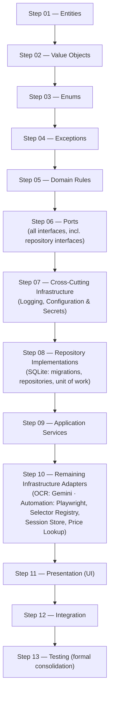
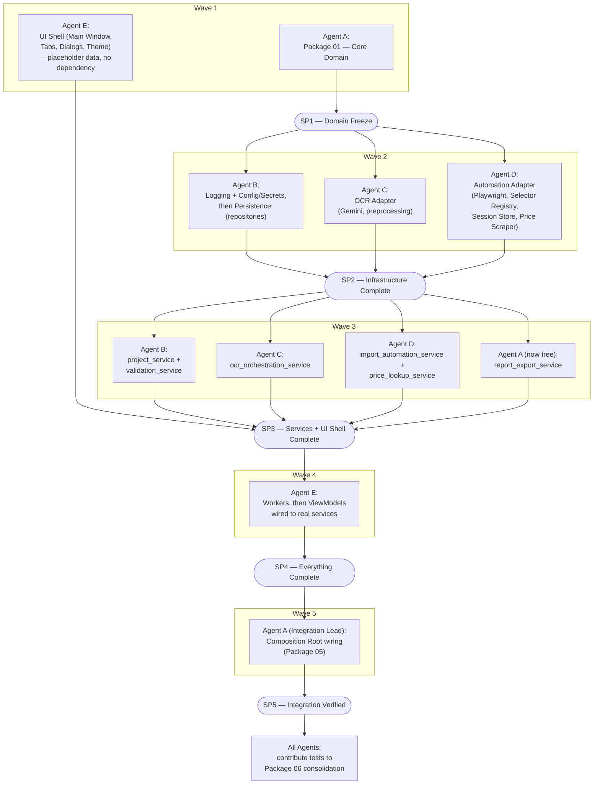
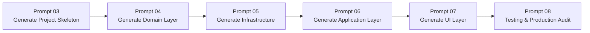

# Implementation Specification & Execution Plan
# Pharmacy Purchase Invoice Automation System

## Document Control

| Field | Value |
|---|---|
| Project | Automated Import of Pharmacy Purchase Invoices into webnhathuoc.com |
| Phase | Implementation Specification — **no code, no class/function bodies, no architectural redesign** |
| Prepared as | Principal Software Architect / Tech Lead / Senior Python Engineer / Clean Architecture & DDD Expert / Playwright Expert / Desktop Application Architect / AI Coding Agent Planner |
| Date | July 26, 2026 |
| Status | Draft v1.0 — Implementation Specification |
| Upstream documents | *Technical Design Document* (v1.0, approved) and *Implementation Blueprint & Development Plan* (v1.0). Every package, module, entity, port, and folder path below is taken verbatim from those two documents; this document only adds file-level and import-level precision. |
| Downstream consumers | Prompts 03–08 (see §13, Prompt Mapping). This document is intended to be their **sole** implementation reference. |

## Table of Contents

1. Executive Summary
2. Package Breakdown
3. Folder Specification
4. File Creation Order
5. Dependency Rules
6. Module Contracts
7. Implementation Sequence
8. Dependency Matrix
9. Parallel Development Plan
10. Coding Checklist
11. Risk Analysis
12. Definition of Done
13. Prompt Mapping
14. Final Execution Plan

---

## 1. Executive Summary

The Technical Design Document established *what* the system is. The Implementation Blueprint established *in what order* it is built, phase by phase. This document goes one level deeper: it names every **folder and file**, states the **exact import rules** for every folder, specifies a **contract** for every module (purpose, inputs/outputs, interfaces, configuration, persistence, logging, error handling, thread safety, retry policy), and — because multiple AI coding agents may implement this system concurrently — defines a **conflict-free parallel work split** with explicit synchronization points.

Two places exist where the source prompt's own illustrative examples, if followed literally, would either contradict the approved architecture or leave a genuine ambiguity. Both are resolved explicitly, in place, rather than silently:

1. **"Repository Interfaces" as a step separate from "Ports."** The TDD defines a single `domain.ports` module that already contains every repository interface (`IInvoiceRepository`, `ISupplierRepository`, etc.) alongside the non-repository interfaces (`IOcrProvider`, `IBrowserAutomation`, …). There is no separate "repository interface" module to build as its own step. §7 (Implementation Sequence) resolves this by treating "Ports" as one step covering all interfaces, and relabeling the following step "**Repository Implementations**" — the concrete SQLite-backed classes — to remove the ambiguity.
2. **"Infrastructure" as a single step after "Application Services."** Logging and Configuration/Secrets must exist *before* repositories can be built or tested (per the Blueprint's Phase 2), which is *before* Application Services (Blueprint Phase 2 precedes the services built in later phases). §7 resolves this by splitting "Infrastructure" into two moments: cross-cutting prerequisites (Logging, Configuration/Secrets) built immediately before Repository Implementations, and the remaining adapters (OCR, Automation, Price Lookup) built after Application Services, exactly as the Blueprint already established.

Everything else in this document is a direct, literal expansion of the TDD and Blueprint — no new module, no renamed module, no removed module.

---

## 2. Package Breakdown

The project is divided into six implementation packages, each mapped to the Clean Architecture layers already established.

| Package | Name | Contents | Primary Layer(s) |
|---|---|---|---|
| **01** | Core Domain | Entities, Value Objects, Enums, Exceptions, Business Rules, Ports | Domain |
| **02** | Application | The six Application services: `project_service`, `ocr_orchestration_service`, `validation_service`, `price_lookup_service`, `import_automation_service`, `report_export_service` | Application |
| **03** | Infrastructure | Logging, Configuration/Secrets, SQLite Persistence, Gemini OCR Adapter, Playwright Automation Adapter, Price Lookup Adapter | Infrastructure |
| **04** | Presentation | Main Window, Tabs, Dialogs, Workers, ViewModels, Theme | Presentation |
| **05** | Integration | Composition Root wiring, cross-tab event bus, resume-on-startup logic, end-to-end pipeline validation | Cross-cutting (touches all layers, owns none) |
| **06** | Testing | Unit, integration, golden-file, automation, UI, load, and regression test suites | Cross-cutting (validates all layers) |

Package boundaries are **directory boundaries** (§3): each package occupies its own top-level or clearly-scoped subfolder, so that two agents working on two different packages never need to edit the same file.

---

## 3. Folder Specification

The tree below expands the TDD's folder structure (§5) down to individual files, following Naming Convention rules (snake_case files, no abbreviations). One `__init__.py` is implied in every Python package folder and is omitted from the listing below for readability, except where its presence carries meaning.

### Package 01 — Core Domain

```
domain/
├── entities/
│   ├── project.py
│   ├── invoice.py
│   ├── invoice_line.py
│   ├── supplier.py
│   └── medicine.py
├── value_objects/
│   ├── money.py
│   ├── tax_code.py
│   ├── expiry_date.py
│   └── quantity.py
├── enums/
│   ├── invoice_status.py
│   ├── medicine_group.py
│   └── unit_type.py
├── exceptions/
│   ├── domain_error.py                  # base class every domain exception derives from
│   ├── invalid_invoice_data_error.py
│   ├── duplicate_supplier_error.py
│   ├── duplicate_medicine_error.py
│   ├── duplicate_invoice_error.py
│   └── invalid_business_rule_error.py
├── rules/
│   ├── supplier_resolution_rule.py
│   ├── medicine_resolution_rule.py
│   ├── prescription_classification_rule.py
│   ├── medicine_code_sequence_rule.py
│   ├── unit_mapping_rule.py
│   ├── duplicate_detection_rule.py
│   └── total_consistency_rule.py
└── ports/
    ├── i_ocr_provider.py
    ├── i_browser_automation.py
    ├── i_invoice_repository.py
    ├── i_supplier_repository.py
    ├── i_medicine_repository.py
    ├── i_project_repository.py
    ├── i_price_lookup_provider.py
    ├── i_settings_provider.py
    └── i_logger.py
```

### Shared (used across all packages, owned alongside Package 01)

```
shared/
├── result.py                            # Result / Outcome type
└── utils/
    ├── file_scanner.py                  # recursive folder -> image file list
    ├── id_generator.py                  # TH1, TH2, ... sequence generation helper
    └── date_utils.py
```

### Package 02 — Application

```
application/
├── project_service/
│   └── project_service.py
├── ocr_orchestration_service/
│   └── ocr_orchestration_service.py
├── validation_service/
│   └── validation_service.py
├── price_lookup_service/
│   └── price_lookup_service.py
├── import_automation_service/
│   └── import_automation_service.py
└── report_export_service/
    └── report_export_service.py
```

### Package 03 — Infrastructure

```
infrastructure/
├── logging/
│   ├── logger_factory.py
│   └── redaction_filter.py
├── config/
│   ├── settings_manager.py
│   ├── secrets_manager.py
│   └── app_settings_schema.py           # Pydantic settings model
├── persistence/
│   ├── migrations/
│   │   └── migration_0001_initial_schema.py
│   ├── sqlite_repositories/
│   │   ├── supplier_repository.py
│   │   ├── medicine_repository.py
│   │   ├── project_repository.py
│   │   ├── invoice_repository.py        # aggregate: Invoice + InvoiceLine
│   │   ├── price_cache_repository.py
│   │   └── run_history_repository.py
│   ├── unit_of_work.py
│   └── persistence_errors.py            # DatabaseError and related wrapper exceptions
├── ocr/
│   ├── image_preprocessor.py
│   ├── prompt_templates/
│   │   ├── invoice_extraction_prompt_v1.md
│   │   └── invoice_extraction_schema_v1.json
│   ├── gemini_adapter.py
│   └── ocr_errors.py                    # GeminiApiError and related wrapper exceptions
└── automation/
    ├── selector_registry/
    │   └── selector_registry_loader.py  # loads/validates the JSON files in top-level /config/
    ├── session_store.py
    ├── playwright_adapter.py
    ├── price_scraper.py
    └── automation_errors.py             # PlaywrightTimeoutError and related wrapper exceptions
```

### Package 04 — Presentation

```
presentation/
├── main_window.py
├── tabs/
│   ├── ocr_tab.py
│   ├── review_tab.py
│   ├── dashboard_tab.py
│   ├── search_tab.py
│   ├── export_tab.py
│   └── settings_tab.py
├── dialogs/
│   ├── supplier_dialog.py
│   └── medicine_dialog.py
├── viewmodels/
│   ├── ocr_tab_viewmodel.py
│   ├── review_tab_viewmodel.py
│   ├── dashboard_tab_viewmodel.py
│   ├── search_tab_viewmodel.py
│   ├── export_tab_viewmodel.py
│   ├── settings_tab_viewmodel.py
│   ├── supplier_dialog_viewmodel.py
│   └── medicine_dialog_viewmodel.py
├── workers/
│   ├── ocr_worker_pool.py
│   └── automation_worker.py
└── theme/
    ├── dark_theme.qss
    └── theme_loader.py
```

### Package 05 — Integration

```
composition_root/
├── bootstrap.py                         # binds every concrete adapter to its domain.ports interface
└── event_bus.py                         # cross-tab domain events: InvoiceOcrCompleted, InvoiceImported, InvoiceFailed

main.py                                  # top-level entry point; calls composition_root.bootstrap
```

### Package 06 — Testing

```
tests/
├── unit/
│   ├── domain/
│   ├── application/
├── integration/
│   ├── persistence/
│   └── full_pipeline/
├── ocr_golden_files/
│   ├── samples/
│   └── expected_json/
├── automation_e2e/
│   ├── staging/
│   └── fixtures_html/
└── fixtures/
    ├── sample_invoices/
    └── mock_ports/
```

### Top-Level Support Files (not owned by any single package; created in Phase 2 / Package 03 setup)

```
config/
├── app_settings.default.toml
├── selector_registry.webnhathuoc.json
└── selector_registry.longchau.json

data/                                    # created at runtime, not authored
├── project.sqlite3
└── logs/

docs/                                    # this document, the TDD, and the Blueprint live here

.env.example
pyproject.toml
```

---

## 4. File Creation Order

Files are created in the order below. Within a package, the order follows the same "innermost, least-dependent first" logic used throughout the TDD and Blueprint. Across packages, the order follows §7 (Implementation Sequence).

### Package 01 — Core Domain (create in this exact order)

1. `shared/result.py`
2. `domain/value_objects/money.py`
3. `domain/value_objects/tax_code.py`
4. `domain/value_objects/expiry_date.py`
5. `domain/value_objects/quantity.py`
6. `domain/enums/invoice_status.py`
7. `domain/enums/medicine_group.py`
8. `domain/enums/unit_type.py`
9. `domain/exceptions/domain_error.py`
10. `domain/exceptions/invalid_invoice_data_error.py`
11. `domain/exceptions/duplicate_supplier_error.py`
12. `domain/exceptions/duplicate_medicine_error.py`
13. `domain/exceptions/duplicate_invoice_error.py`
14. `domain/exceptions/invalid_business_rule_error.py`
15. `domain/entities/supplier.py`
16. `domain/entities/medicine.py`
17. `domain/entities/project.py`
18. `domain/entities/invoice_line.py`
19. `domain/entities/invoice.py` *(depends on `invoice_line.py`, created after it)*
20. `domain/rules/unit_mapping_rule.py`
21. `domain/rules/medicine_code_sequence_rule.py`
22. `domain/rules/prescription_classification_rule.py`
23. `domain/rules/supplier_resolution_rule.py`
24. `domain/rules/medicine_resolution_rule.py`
25. `domain/rules/duplicate_detection_rule.py`
26. `domain/rules/total_consistency_rule.py`
27. `shared/utils/id_generator.py`
28. `shared/utils/date_utils.py`
29. `shared/utils/file_scanner.py`
30. `domain/ports/i_logger.py`
31. `domain/ports/i_settings_provider.py`
32. `domain/ports/i_project_repository.py`
33. `domain/ports/i_supplier_repository.py`
34. `domain/ports/i_medicine_repository.py`
35. `domain/ports/i_invoice_repository.py`
36. `domain/ports/i_price_lookup_provider.py`
37. `domain/ports/i_ocr_provider.py`
38. `domain/ports/i_browser_automation.py`

*(Steps 30–38: ports are ordered from least- to most-complex, but all nine are reviewed and frozen together — see Blueprint §2, Phase 1 exit criteria — before any Package 03 file is created.)*

### Package 03 — Infrastructure, Part A: Cross-Cutting Prerequisites (created before Application, per §1's resolved ambiguity)

39. `infrastructure/logging/redaction_filter.py`
40. `infrastructure/logging/logger_factory.py`
41. `infrastructure/config/app_settings_schema.py`
42. `infrastructure/config/secrets_manager.py`
43. `infrastructure/config/settings_manager.py`
44. `config/app_settings.default.toml`
45. `.env.example`

### Package 03 — Infrastructure, Part B: Persistence

46. `infrastructure/persistence/persistence_errors.py`
47. `infrastructure/persistence/migrations/migration_0001_initial_schema.py`
48. `infrastructure/persistence/sqlite_repositories/supplier_repository.py`
49. `infrastructure/persistence/sqlite_repositories/medicine_repository.py`
50. `infrastructure/persistence/sqlite_repositories/project_repository.py`
51. `infrastructure/persistence/sqlite_repositories/invoice_repository.py`
52. `infrastructure/persistence/sqlite_repositories/price_cache_repository.py`
53. `infrastructure/persistence/sqlite_repositories/run_history_repository.py`
54. `infrastructure/persistence/unit_of_work.py`

### Package 02 — Application

55. `application/project_service/project_service.py`
56. `application/ocr_orchestration_service/ocr_orchestration_service.py`
57. `application/validation_service/validation_service.py`
58. `application/price_lookup_service/price_lookup_service.py`
59. `application/import_automation_service/import_automation_service.py`
60. `application/report_export_service/report_export_service.py`

*(Files 56–60 reference infrastructure adapters — `gemini_adapter`, `playwright_adapter`, `price_scraper` — that do not exist yet at this point in the sequence. This is expected: Application services depend only on `domain.ports`, never on concrete Infrastructure, so they are written and unit-tested against fakes before Package 03 Part C exists. See §5 for the enforced import rule that makes this possible.)*

### Package 03 — Infrastructure, Part C: OCR and Automation Adapters

61. `infrastructure/ocr/prompt_templates/invoice_extraction_schema_v1.json`
62. `infrastructure/ocr/prompt_templates/invoice_extraction_prompt_v1.md`
63. `infrastructure/ocr/image_preprocessor.py`
64. `infrastructure/ocr/ocr_errors.py`
65. `infrastructure/ocr/gemini_adapter.py`
66. `config/selector_registry.webnhathuoc.json`
67. `config/selector_registry.longchau.json`
68. `infrastructure/automation/selector_registry/selector_registry_loader.py`
69. `infrastructure/automation/automation_errors.py`
70. `infrastructure/automation/session_store.py`
71. `infrastructure/automation/playwright_adapter.py`
72. `infrastructure/automation/price_scraper.py`

### Package 04 — Presentation

73. `presentation/theme/dark_theme.qss`
74. `presentation/theme/theme_loader.py`
75. `presentation/main_window.py`
76. `presentation/tabs/ocr_tab.py`
77. `presentation/tabs/review_tab.py`
78. `presentation/tabs/dashboard_tab.py`
79. `presentation/tabs/search_tab.py`
80. `presentation/tabs/export_tab.py`
81. `presentation/tabs/settings_tab.py`
82. `presentation/dialogs/supplier_dialog.py`
83. `presentation/dialogs/medicine_dialog.py`
84. `presentation/workers/ocr_worker_pool.py`
85. `presentation/workers/automation_worker.py`
86. `presentation/viewmodels/ocr_tab_viewmodel.py`
87. `presentation/viewmodels/review_tab_viewmodel.py`
88. `presentation/viewmodels/dashboard_tab_viewmodel.py`
89. `presentation/viewmodels/search_tab_viewmodel.py`
90. `presentation/viewmodels/export_tab_viewmodel.py`
91. `presentation/viewmodels/settings_tab_viewmodel.py`
92. `presentation/viewmodels/supplier_dialog_viewmodel.py`
93. `presentation/viewmodels/medicine_dialog_viewmodel.py`

### Package 05 — Integration

94. `composition_root/event_bus.py`
95. `composition_root/bootstrap.py`
96. `main.py`

### Package 06 — Testing (test files are created *alongside* the module they test, per §11 of the Blueprint — the numbered list below represents the *consolidation* pass, not the first time any test is written)

97. `tests/fixtures/mock_ports/` (fakes for every `domain.ports` interface)
98. `tests/fixtures/sample_invoices/`
99. `tests/unit/domain/` (consolidated from Package 01)
100. `tests/unit/application/` (consolidated from Package 02)
101. `tests/integration/persistence/` (consolidated from Package 03 Part B)
102. `tests/ocr_golden_files/samples/` and `expected_json/` (consolidated from Package 03 Part C)
103. `tests/automation_e2e/staging/` and `fixtures_html/` (consolidated from Package 03 Part C)
104. `tests/integration/full_pipeline/` (new — requires Package 05 complete)

---

## 5. Dependency Rules

Enforcing these rules is what makes §4's "write Application services before the adapters they'll eventually use" ordering possible: because `application` may only import `domain`, it genuinely cannot accidentally couple itself to a concrete adapter that doesn't exist yet.

| Folder | CAN import | CANNOT import | Allowed Dependencies | Forbidden Dependencies |
|---|---|---|---|---|
| `domain/` | `typing`, `dataclasses`, `enum`, `datetime`, `decimal`, other `domain/*` submodules, `shared/result` | anything from `application/`, `infrastructure/`, `presentation/`, `composition_root/` | Python standard library only | `sqlite3`, `httpx`/`requests`, `playwright`, `PySide6`, `google-genai` (Gemini SDK), any third-party package |
| `shared/` | `typing`, `dataclasses`, standard library only | anything from `domain/`, `application/`, `infrastructure/`, `presentation/` | Python standard library only | Every third-party package; every other layer (this must remain usable *from* any layer without pulling anything *in*) |
| `application/` | `domain/*`, `shared/*` | `infrastructure/*` (concrete adapters), `presentation/*`, `composition_root/*` | `domain.ports` interfaces only — never a concrete Infrastructure class | Direct import of `gemini_adapter`, `playwright_adapter`, `sqlite_repositories`, `PySide6`, or any concrete adapter module |
| `infrastructure/logging/` | `logging` (stdlib), `domain.ports.i_logger` | `application/*`, `presentation/*`, other `infrastructure/*` submodules (this module has no peer dependencies) | stdlib `logging` only | `application/*`, `presentation/*` |
| `infrastructure/config/` | `pydantic`, `python-dotenv`, OS keyring library, `domain.ports.i_settings_provider` | `application/*`, `presentation/*` | Pydantic, dotenv, keyring/Fernet | `application/*`, `presentation/*` |
| `infrastructure/persistence/` | `sqlite3` (or an async equivalent), `domain/*` (entities, ports), `infrastructure/logging/*`, `infrastructure/config/*` | `application/*`, `presentation/*`, `infrastructure/ocr/*`, `infrastructure/automation/*` | SQLite driver only for external I/O | `application/*`, `presentation/*`, sibling adapters (persistence never talks to OCR/automation directly) |
| `infrastructure/ocr/` | `google-genai` (Gemini SDK), `httpx`, `opencv-python`, `Pillow`, `domain/*`, `infrastructure/logging/*`, `infrastructure/config/*` | `application/*`, `presentation/*`, `infrastructure/persistence/*`, `infrastructure/automation/*` | Gemini SDK, OpenCV, Pillow, httpx | `application/*`, `presentation/*`, sibling adapters |
| `infrastructure/automation/` | `playwright`, `domain/*`, `infrastructure/logging/*`, `infrastructure/config/*` | `application/*`, `presentation/*`, `infrastructure/persistence/*`, `infrastructure/ocr/*` | Playwright only | `application/*`, `presentation/*`, sibling adapters |
| `presentation/` | `PySide6`, `presentation/viewmodels/*` (from Views only), `domain/*` (DTOs/entities for display only, never for business logic) | `application/*` (Views/Dialogs/Tabs may not import it directly — only `viewmodels/` may), `infrastructure/*` | PySide6 | `infrastructure/*` from any file other than `composition_root` |
| `presentation/viewmodels/` | `application/*`, `PySide6` (for `QObject`/signal base classes), `domain/*` | `infrastructure/*` directly (must go through `application` ports) | `application/*` services only | Any concrete `infrastructure/*` adapter |
| `composition_root/` | **Everything** — `domain/*`, `application/*`, `infrastructure/*`, `presentation/*` | Nothing is forbidden here | All layers, by design | N/A — this is the one deliberate exception to the dependency rule, and it exists nowhere else |
| `tests/` | Everything needed for the code under test, plus `pytest`/`pytest-qt`/test doubles | N/A — tests may import anything they need to test | Testing frameworks + the module under test | Tests must not import from `composition_root/` except in `tests/integration/full_pipeline/`, to keep unit tests from accidentally becoming full-system tests |

**Enforcement note.** These rules should be checked mechanically (e.g., an import-linter configuration or equivalent static check) as part of Phase 7 (Blueprint §2), but the rule itself is binding from the very first file created in Package 01 onward — it is not something to "clean up later."

---

## 6. Module Contracts

Contracts are specified at **module granularity** (one contract per subfolder/component from §3), not per individual file — a `__init__.py` or a single small value-object file does not warrant its own 11-attribute contract. Each module's file list from §3 is its **Internal Components**.

### Domain Layer

#### `domain/entities`
- **Purpose:** Represent the core business objects the entire system reasons about.
- **Responsibilities:** Enforce entity-level invariants (e.g., an `Invoice` cannot have a negative grand total); expose behavior needed by rules and services (e.g., `Invoice.recalculate_grand_total()`).
- **Inputs:** Constructor/factory arguments from Application services.
- **Outputs:** In-memory domain objects.
- **Public Interfaces:** The five entity classes and their behavior methods.
- **Internal Components:** `project.py`, `invoice.py`, `invoice_line.py`, `supplier.py`, `medicine.py`.
- **Configuration Required:** None.
- **Persistence Required:** None — persistence-ignorant by design.
- **Logging Required:** None.
- **Error Handling Strategy:** Raise `domain/exceptions` types only for true invariant violations; never for expected "not found" conditions.
- **Thread Safety:** Entities are plain, mutable-by-convention data objects. They are not inherently thread-safe and must not be shared across threads without external synchronization; in practice, `application` services confine an entity's mutation to a single OCR-worker or automation-worker context, so no entity is ever mutated concurrently in this system's design.
- **Retry Policy:** N/A — entities perform no I/O.

#### `domain/value_objects`
- **Purpose:** Encapsulate primitive values with validated invariants and correct arithmetic (notably currency rounding for `Money`).
- **Responsibilities:** Reject invalid construction immediately; provide comparison/arithmetic behavior.
- **Inputs:** Raw primitives (float, string, date).
- **Outputs:** Validated, immutable value objects.
- **Public Interfaces:** `Money`, `TaxCode`, `ExpiryDate`, `Quantity`.
- **Internal Components:** `money.py`, `tax_code.py`, `expiry_date.py`, `quantity.py`.
- **Configuration Required:** None.
- **Persistence Required:** None.
- **Logging Required:** None.
- **Error Handling Strategy:** Fail fast at construction (raise `InvalidInvoiceDataError` or a more specific value-object error) rather than allowing an invalid value to propagate.
- **Thread Safety:** Immutable by design — inherently thread-safe.
- **Retry Policy:** N/A.

#### `domain/enums`
- **Purpose:** Provide the fixed symbolic vocabularies used across entities and rules.
- **Responsibilities:** None beyond defining valid members.
- **Inputs/Outputs:** Fixed values.
- **Public Interfaces:** `InvoiceStatus`, `MedicineGroup`, `UnitType`.
- **Internal Components:** `invoice_status.py`, `medicine_group.py`, `unit_type.py`.
- **Configuration Required:** None. **Persistence Required:** stored as string/int by repositories, not by this module. **Logging Required:** None.
- **Error Handling Strategy:** Invalid construction fails immediately at the language level.
- **Thread Safety:** Immutable — inherently thread-safe.
- **Retry Policy:** N/A.

#### `domain/exceptions`
- **Purpose:** Provide the vocabulary of expected domain-level failure conditions.
- **Responsibilities:** One exception type per distinct invariant violation, all deriving from a common `DomainError` base so calling code can catch broadly or narrowly as needed.
- **Inputs:** A human-readable message and any relevant context (e.g., which field failed).
- **Outputs:** Raised exception instances.
- **Public Interfaces:** `DomainError` (base), `InvalidInvoiceDataError`, `DuplicateSupplierError`, `DuplicateMedicineError`, `DuplicateInvoiceError`, `InvalidBusinessRuleError`.
- **Internal Components:** as named above, one file each.
- **Configuration Required:** None. **Persistence Required:** None. **Logging Required:** None (the *catcher*, not the exception itself, logs).
- **Error Handling Strategy:** This module *is* part of the error-handling strategy for the rest of the system.
- **Thread Safety:** Exceptions are immutable once constructed — inherently thread-safe.
- **Retry Policy:** N/A.

#### `domain/rules`
- **Purpose:** Encode every Business Rule document line item as a pure, testable validator/derivation.
- **Responsibilities:** Supplier resolution, medicine resolution, prescription/OTC classification (with documented fallback), medicine-code sequencing (`TH1`, `TH2`, …), unit mapping (`viên` → viên, `tuýp` → tuýp), duplicate detection, invoice-total consistency.
- **Inputs:** Entities, value objects, and (for rules needing existing data, e.g. duplicate detection or code sequencing) data already fetched by the calling Application service — rules never fetch data themselves.
- **Outputs:** A `Result` (via `shared.result`) or a derived value (e.g., the next medicine code string).
- **Public Interfaces:** One callable per rule file.
- **Internal Components:** the seven rule files listed in §3.
- **Configuration Required:** None. **Persistence Required:** None (see Inputs). **Logging Required:** None directly — the calling service logs the outcome.
- **Error Handling Strategy:** Never raise for an expected business outcome; always return a `Result`. May raise a `domain/exceptions` type only for a true invariant violation passed in by a caller that should have prevented it.
- **Thread Safety:** Pure functions over immutable/local data — inherently thread-safe; safe to invoke concurrently from multiple OCR workers.
- **Retry Policy:** N/A — rules are deterministic and perform no I/O; a "failure" is a business outcome, not a transient error to retry.

#### `domain/ports`
- **Purpose:** Define the abstract contract boundary between Application/Domain and every concrete Infrastructure implementation.
- **Responsibilities:** Specify method signatures, expected `Result`/exception shapes, and behavioral guarantees each implementation must honor.
- **Inputs/Outputs:** Defined per interface.
- **Public Interfaces:** `IOcrProvider`, `IBrowserAutomation`, `IInvoiceRepository`, `ISupplierRepository`, `IMedicineRepository`, `IProjectRepository`, `IPriceLookupProvider`, `ISettingsProvider`, `ILogger`.
- **Internal Components:** the nine `i_*.py` files listed in §3.
- **Configuration Required:** None. **Persistence Required:** N/A (interfaces only). **Logging Required:** N/A.
- **Error Handling Strategy:** Each interface's docstring specifies which `domain/exceptions` types (if any) and which `Result` shape callers must handle.
- **Thread Safety:** N/A (interfaces carry no state).
- **Retry Policy:** Each interface documents whether retry is the *caller's* responsibility (true for all ports in this system — see TDD §13.2) or the implementation's; in this architecture, retry is always implemented inside the concrete adapter, never inside the calling service, so the port itself only needs to specify that a transient failure surfaces as a specific, recognizable error type.

---

### Application Layer

#### `application/project_service`
- **Purpose:** Own the lifecycle of a `Project` (create, open, auto-save).
- **Responsibilities:** Translate a user's folder selection into a persisted `Project`; keep working state current across the app lifecycle (FR-01).
- **Inputs:** Folder path(s), project name.
- **Outputs:** A `Project` aggregate; a `Result` on failure ("folder not found," "project already exists").
- **Public Interfaces:** create project, open project, list projects, auto-save.
- **Internal Components:** `project_service.py`.
- **Configuration Required:** default working folder (from `ISettingsProvider`).
- **Persistence Required:** `IProjectRepository`.
- **Logging Required:** `pharmacy_automation.database`.
- **Error Handling Strategy:** returns `Result`, never raises for expected conditions.
- **Thread Safety:** invoked from the UI thread via a ViewModel; internally, any repository call is awaited/blocking on a background thread so the UI thread is never blocked — this service holds no mutable shared state of its own.
- **Retry Policy:** none needed at this level — local file/DB operations are not modeled as transient-failure-prone in this design; a failure here is treated as permanent and surfaced immediately.

#### `application/ocr_orchestration_service`
- **Purpose:** Drive the OCR pipeline across a batch of images.
- **Responsibilities:** Feed images to `IOcrProvider`; persist every result immediately; expose progress; support manual retry of a failed invoice.
- **Inputs:** an image file list (from `project_service`/`shared.utils.file_scanner`).
- **Outputs:** persisted `Invoice`/`InvoiceLine` records with status `OcrDone`/`OcrFailed`.
- **Public Interfaces:** enqueue images, process one image, get progress, retry failed invoice.
- **Internal Components:** `ocr_orchestration_service.py`.
- **Configuration Required:** OCR concurrency limit, retry count (from `ISettingsProvider`).
- **Persistence Required:** `IInvoiceRepository`.
- **Logging Required:** `pharmacy_automation.ocr`, `pharmacy_automation.gemini_api`.
- **Error Handling Strategy:** classifies transient vs. permanent per TDD §7.6; a single image's failure never halts the batch.
- **Thread Safety:** designed to be invoked concurrently across a bounded worker pool (TDD §14.1); must not hold any mutable state shared across concurrent calls other than what the underlying `IInvoiceRepository` implementation itself guarantees to serialize.
- **Retry Policy:** bounded exponential backoff on transient `IOcrProvider` failures, max attempts from settings; non-retryable failures are marked `OcrFailed` immediately.

#### `application/validation_service`
- **Purpose:** Gate an invoice's transition to `ReadyForImport`.
- **Responsibilities:** Run every applicable `domain/rules` validator against a draft invoice, including duplicate checks against persisted data.
- **Inputs:** a draft `Invoice` (post-OCR or post-user-edit).
- **Outputs:** pass/fail plus a structured issue list.
- **Public Interfaces:** validate invoice, list outstanding issues.
- **Internal Components:** `validation_service.py`.
- **Configuration Required:** none beyond what rules themselves need.
- **Persistence Required:** `IInvoiceRepository`, `ISupplierRepository`, `IMedicineRepository` (read-only, for duplicate/consistency checks); writes the resulting status transition via `IInvoiceRepository`.
- **Logging Required:** `pharmacy_automation.error` on a recorded validation failure.
- **Error Handling Strategy:** returns a structured issue list; never throws for a validation failure.
- **Thread Safety:** invoked once per invoice from the Review tab; safe to invoke for different invoices concurrently since it holds no shared mutable state.
- **Retry Policy:** none — validation is deterministic given its inputs; a repository read failure here is treated as a database error (TDD §13), not retried at this layer.

#### `application/price_lookup_service`
- **Purpose:** Resolve a retail price for a medicine, using a cache-first strategy.
- **Responsibilities:** Check `PriceCacheRepository` before calling `IPriceLookupProvider`; invalidate expired cache entries; degrade gracefully to "not found" on lookup failure.
- **Inputs:** medicine name/specification.
- **Outputs:** a resolved price or a "not found" flag.
- **Public Interfaces:** get price, invalidate cache entry.
- **Internal Components:** `price_lookup_service.py`.
- **Configuration Required:** price cache TTL (from `ISettingsProvider`).
- **Persistence Required:** price cache repository (via `IProjectRepository`-adjacent persistence; the `PriceCacheRepository` concrete class from Package 03).
- **Logging Required:** `pharmacy_automation.automation`, `pharmacy_automation.retry`.
- **Error Handling Strategy:** a live-lookup failure degrades to "not found → flag for manual entry," never blocks the invoice.
- **Thread Safety:** may be invoked from within the sequential automation worker only (by design, since it is called from `import_automation_service`); not designed for concurrent invocation, and does not need to be, since automation itself is sequential.
- **Retry Policy:** bounded retry on transient `IPriceLookupProvider` failures (network-level), then falls back to "not found."

#### `application/import_automation_service`
- **Purpose:** Orchestrate the sequential website automation for one `ReadyForImport` invoice at a time.
- **Responsibilities:** Call `IBrowserAutomation` through login, supplier/medicine resolution (using `domain.rules`), price lookup (via `price_lookup_service`), fill, and save; update invoice status; isolate every failure to its own invoice.
- **Inputs:** a `ReadyForImport` invoice.
- **Outputs:** `Imported` or `ImportFailed` status, with a reason on failure.
- **Public Interfaces:** import one invoice, get automation progress, pause/resume/stop the automation queue.
- **Internal Components:** `import_automation_service.py`.
- **Configuration Required:** timeouts, retry counts, headless mode, credentials (via `ISettingsProvider`, which delegates secrets to the Secrets Manager).
- **Persistence Required:** `IInvoiceRepository` (status updates), `ISupplierRepository`, `IMedicineRepository` (mirroring what automation created/selected on the live site).
- **Logging Required:** `pharmacy_automation.automation`, `pharmacy_automation.retry`, `pharmacy_automation.error`.
- **Error Handling Strategy:** per-invoice isolation (TDD §13.4) — a failure here is logged and the batch proceeds to the next invoice; never silently skipped.
- **Thread Safety:** this service is the one place in the Application layer that is **not** designed for concurrent invocation — it must only ever be driven by the single automation worker thread (TDD §8.1, §14.1), by design, because it drives a single shared Playwright session.
- **Retry Policy:** per-action retry with backoff for browser actions (TDD §13.2); session-expiry triggers an automatic re-login rather than a generic retry.

#### `application/report_export_service`
- **Purpose:** Aggregate and expose read-only views of the whole system's state.
- **Responsibilities:** dashboard counters, search, JSON/Excel/log export, run reports.
- **Inputs:** query filters; a completed batch.
- **Outputs:** dashboard counter DTOs, export files, report DTOs.
- **Public Interfaces:** get dashboard counts, search, export, generate report.
- **Internal Components:** `report_export_service.py`.
- **Configuration Required:** export output location (from `ISettingsProvider`).
- **Persistence Required:** read-only across every repository.
- **Logging Required:** `pharmacy_automation.database` for query activity.
- **Error Handling Strategy:** an export failure is surfaced to the UI, never silently dropped.
- **Thread Safety:** read-only and stateless — safe to invoke concurrently with any other service, including itself.
- **Retry Policy:** none needed — read/export failures are treated as permanent and surfaced immediately.

---

### Infrastructure Layer

#### `infrastructure/logging`
- **Purpose:** Provide the single, shared logging facility for every other module.
- **Responsibilities:** per-category child loggers, rotation, redaction of secrets before any sink is written.
- **Inputs:** log calls (category, level, message, correlation ID) from any layer.
- **Outputs:** rotated log files, console output.
- **Public Interfaces:** `get_logger(category)`, implementing `ILogger`.
- **Internal Components:** `redaction_filter.py`, `logger_factory.py`.
- **Configuration Required:** log level, retention days (from `settings_manager`, which is built *after* this module — see §5's note that `logging` has no peer dependencies within `infrastructure/`, meaning `logger_factory` reads its own minimal bootstrap defaults directly rather than depending on `settings_manager`, avoiding a circular build dependency).
- **Persistence Required:** log files on disk.
- **Logging Required:** N/A (this *is* logging).
- **Error Handling Strategy:** a logging failure must never crash the caller — internally fail-safe (e.g., fall back to console if file rotation fails).
- **Thread Safety:** must be safe to call concurrently from every OCR worker and the automation thread simultaneously — this is a hard requirement, not an optimization.
- **Retry Policy:** none — logging failures are swallowed internally, never retried or surfaced.

#### `infrastructure/config`
- **Purpose:** Provide typed, validated, layered settings and secure secret storage.
- **Responsibilities:** load defaults → file → env → UI-set overrides (`settings_manager`); store/retrieve secrets via OS keyring with encrypted-file fallback (`secrets_manager`).
- **Inputs:** `.env`, `config/app_settings.default.toml`, UI input.
- **Outputs:** a validated `AppSettings` object; secret values only to explicitly authorized callers.
- **Public Interfaces:** `get_setting(key)`, `set_setting(key, value)`, `get_secret(key)`, `set_secret(key, value)`, implementing `ISettingsProvider`.
- **Internal Components:** `app_settings_schema.py`, `secrets_manager.py`, `settings_manager.py`.
- **Configuration Required:** N/A (this module *is* configuration).
- **Persistence Required:** the settings file (non-secret values) and OS credential store / encrypted file (secrets).
- **Logging Required:** `pharmacy_automation.error` on validation failure — secret values are never logged, enforced by the redaction filter from `infrastructure/logging`.
- **Error Handling Strategy:** invalid values are rejected at the boundary (Pydantic validation) before reaching any consumer.
- **Thread Safety:** settings are effectively read-mostly after startup; `set_setting`/`set_secret` calls from the Settings Tab are serialized through the single Settings ViewModel, so no concurrent-write scenario exists by design.
- **Retry Policy:** none — a corrupt settings file or inaccessible keyring is a startup-blocking error, surfaced immediately rather than retried.

#### `infrastructure/persistence`
- **Purpose:** Implement every `I*Repository` port against SQLite.
- **Responsibilities:** CRUD, search, dashboard-aggregation queries, schema migrations, multi-repository transactions.
- **Inputs:** domain entities to persist; query parameters.
- **Outputs:** persisted rows; query results mapped back to domain entities.
- **Public Interfaces:** `SupplierRepository`, `MedicineRepository`, `ProjectRepository`, `InvoiceRepository`, `PriceCacheRepository`, `RunHistoryRepository`, `UnitOfWork`.
- **Internal Components:** as listed in §3.
- **Configuration Required:** database file path (from `settings_manager`).
- **Persistence Required:** N/A (this module *is* persistence).
- **Logging Required:** `pharmacy_automation.database`.
- **Error Handling Strategy:** wraps raw SQLite errors into `persistence_errors.py` types (e.g., a `DatabaseError`) before they cross back into `application`.
- **Thread Safety:** SQLite connections are not shared across threads; each repository call obtains/returns a connection from a per-thread or per-call connection strategy, and the `unit_of_work` is the only construct allowed to span multiple repository calls in one transaction.
- **Retry Policy:** transient lock-contention errors (SQLite `database is locked`) are retried a small, bounded number of times with a short backoff; all other errors are treated as permanent.

#### `infrastructure/ocr`
- **Purpose:** Implement `IOcrProvider` against Gemini Vision, including preprocessing and normalization.
- **Responsibilities:** auto-rotate/deskew/crop/denoise/contrast-enhance; build the schema-constrained Gemini request from versioned prompt templates; validate and normalize the response; compute confidence.
- **Inputs:** a raw invoice image.
- **Outputs:** normalized, confidence-scored structured data (or a classified error).
- **Public Interfaces:** `extract(image) -> Result[NormalizedInvoiceData]`, implementing `IOcrProvider`.
- **Internal Components:** `image_preprocessor.py`, `prompt_templates/*`, `gemini_adapter.py`, `ocr_errors.py`.
- **Configuration Required:** Gemini API key (secret), model identifier/version, timeout, retry count.
- **Persistence Required:** none — purely transformational; the caller persists the result.
- **Logging Required:** `pharmacy_automation.ocr`, `pharmacy_automation.gemini_api`.
- **Error Handling Strategy:** classifies transient (timeout, 5xx, rate limit) vs. permanent (malformed image, content-policy rejection, invalid key) per TDD §7.6, wrapping raw SDK errors into `ocr_errors.py` types.
- **Thread Safety:** must be safe to invoke concurrently from the bounded OCR worker pool; holds no mutable instance state across calls beyond a shared, thread-safe HTTP client.
- **Retry Policy:** exponential backoff, bounded by the configured max attempt count, applied only to transient errors.

#### `infrastructure/automation`
- **Purpose:** Implement `IBrowserAutomation` and `IPriceLookupProvider` against Playwright.
- **Responsibilities:** browser/session lifecycle, the five workflows (Login, Open Import Invoice, Create Supplier, Create Medicine, Fill & Save), popup/dialog handling, wait strategy, Long Châu price lookup.
- **Inputs:** a resolved `Invoice` ready for import; a medicine name (for price lookup).
- **Outputs:** success/failure per workflow; a price or "not found."
- **Public Interfaces:** `login()`, `open_import_form()`, `resolve_supplier(...)`, `resolve_medicine(...)`, `fill_and_save(invoice)`, `lookup_price(medicine_name)`.
- **Internal Components:** `selector_registry/selector_registry_loader.py`, `session_store.py`, `playwright_adapter.py`, `price_scraper.py`, `automation_errors.py`.
- **Configuration Required:** website credentials (secret), timeouts, retry count, headless mode.
- **Persistence Required:** `session_store` only (encrypted `storage_state`); business data flows back through `application.import_automation_service`, not written directly here.
- **Logging Required:** `pharmacy_automation.automation`, `pharmacy_automation.retry`.
- **Error Handling Strategy:** popup/dialog handlers and a documented wait strategy (TDD §8.3); wraps Playwright errors into `automation_errors.py` types.
- **Thread Safety:** explicitly **not** designed for concurrent invocation — a single Playwright browser/session is driven by exactly one caller (the automation worker) at a time, by architectural design (TDD §8.1, §14.1), not as a temporary limitation.
- **Retry Policy:** per-action retry with backoff distinguishing network vs. UI-state errors (TDD §8.3); session-expiry triggers automatic re-login rather than a bare retry of the failed action.

---

### Presentation Layer

#### `presentation/main_window`, `tabs`, `dialogs`
- **Purpose:** Render the application shell and every user-facing screen.
- **Responsibilities:** layout and visual state only; forward user intent to ViewModels.
- **Inputs:** user interaction (clicks, form input).
- **Outputs:** rendered UI; signals to ViewModels.
- **Public Interfaces:** standard Qt widget APIs.
- **Internal Components:** `main_window.py` and the six tab files, two dialog files, listed in §3.
- **Configuration Required:** none directly (Settings Tab displays settings *via* its ViewModel).
- **Persistence Required:** none.
- **Logging Required:** none directly.
- **Error Handling Strategy:** surfaces `Result` failures received from ViewModels as user-facing messages; contains no business error handling of its own.
- **Thread Safety:** must only ever be touched from the Qt main thread — this is a Qt-imposed constraint, not a design choice, and every cross-thread update must arrive via a signal, never a direct call.
- **Retry Policy:** N/A — Views never perform retryable operations themselves.

#### `presentation/workers`
- **Purpose:** Bridge background execution (asyncio OCR pool, sequential automation thread) to the Qt main thread.
- **Responsibilities:** start/pause/resume/stop for both the OCR pool and the automation queue; translate Application-layer progress into Qt signals.
- **Inputs:** work items dispatched by ViewModels.
- **Outputs:** progress signals.
- **Public Interfaces:** start, pause, resume, stop (per worker).
- **Internal Components:** `ocr_worker_pool.py`, `automation_worker.py`.
- **Configuration Required:** OCR concurrency limit (relayed from `settings_manager` via the calling service).
- **Persistence Required:** none — delegates entirely to the Application services it drives.
- **Logging Required:** relays to the same category loggers used by the services it invokes; does not create its own categories.
- **Error Handling Strategy:** catches anything unhandled from the Application layer and converts it into a UI-safe signal rather than crashing the background thread/event loop.
- **Thread Safety:** `ocr_worker_pool.py` manages its own bounded-concurrency asyncio event loop; `automation_worker.py` manages exactly one dedicated thread — the two must never share a thread or event loop, matching the two-speed concurrency model (TDD §14.1).
- **Retry Policy:** delegates entirely to the Application service being driven; the worker itself does not add a second retry layer on top.

#### `presentation/viewmodels`
- **Purpose:** The MVVM bridge — the only Presentation module permitted to call `application/*`.
- **Responsibilities:** translate UI events into Application-service calls; translate results/DTOs back into Qt-signal-emitting, UI-bindable state.
- **Inputs:** UI events (from Views/Dialogs) and Application-service results (via Workers where the call is long-running).
- **Outputs:** Qt signals carrying DTOs.
- **Public Interfaces:** one ViewModel class per tab/dialog.
- **Internal Components:** the eight files listed in §3.
- **Configuration Required:** none directly.
- **Persistence Required:** none directly.
- **Logging Required:** none directly.
- **Error Handling Strategy:** translates a `Result` failure into UI-presentable state (an error message, a flagged field) rather than letting an exception reach the View.
- **Thread Safety:** ViewModels themselves live on the Qt main thread (as `QObject` subclasses) and must never block it; any call into a Worker is fire-and-forget from the ViewModel's perspective, with the result arriving later via signal.
- **Retry Policy:** none of its own — a ViewModel never retries; it only ever reflects whatever the underlying Application service/Worker already decided.

#### `presentation/theme`
- **Purpose:** Apply the application's dark-mode visual identity.
- **Responsibilities:** load and apply the QSS stylesheet at startup.
- **Inputs:** none (static asset).
- **Outputs:** styled application.
- **Public Interfaces:** `apply_theme(app)`.
- **Internal Components:** `dark_theme.qss`, `theme_loader.py`.
- **Configuration Required:** none (a future light-theme toggle would live in `settings_manager`, out of scope for v1).
- **Persistence Required:** none.
- **Logging Required:** none.
- **Error Handling Strategy:** a missing/malformed stylesheet falls back to the Qt default style rather than failing to launch.
- **Thread Safety:** applied once at startup on the main thread; not a concern thereafter.
- **Retry Policy:** N/A.

### Package 05 — Integration Layer

#### `composition_root`
- **Purpose:** The single place in the entire system where every concrete Infrastructure adapter is bound to its `domain.ports` interface and handed to the Application services and Presentation layer that need it.
- **Responsibilities:** dependency injection wiring; application startup sequencing; cross-tab event bus.
- **Inputs:** none (this is the entry point).
- **Outputs:** a fully-wired, running application.
- **Public Interfaces:** `bootstrap()`, `EventBus.publish(event)` / `EventBus.subscribe(event_type, handler)`.
- **Internal Components:** `bootstrap.py`, `event_bus.py`, plus the top-level `main.py`.
- **Configuration Required:** all of it — this is the one module allowed to read every setting, because it constructs every other module.
- **Persistence Required:** none directly.
- **Logging Required:** `pharmacy_automation` root logger for startup/shutdown events.
- **Error Handling Strategy:** a global, top-level exception handler wraps the entire application lifecycle, per TDD §13.1 — this is the only appropriate place for such a catch-all to exist.
- **Thread Safety:** runs once at startup on the main thread; the `EventBus` itself must be thread-safe, since events are published from OCR workers, the automation thread, and the Qt main thread alike.
- **Retry Policy:** N/A for wiring itself; a startup failure (e.g., cannot open the database) is surfaced to the user immediately, not retried silently.

---

## 7. Implementation Sequence

As flagged in §1, this sequence resolves two ambiguities in how the source prompt's own example could be read: "Repository Interfaces" is relabeled "Repository Implementations" (the interfaces already exist as part of "Ports"), and "Infrastructure" is split into its cross-cutting prerequisites (needed before persistence) and its remaining adapters (needed after Application Services), matching the Blueprint's already-established Phase 2 vs. Phase 3/4 ordering.



| Step | Why here, not earlier or later |
|---|---|
| 01 Entities | Everything downstream names an entity; there is no correct place to start except here. |
| 02 Value Objects | Entities reference `Money`, `TaxCode`, `ExpiryDate`, `Quantity` in their own fields — these must be decided before an entity's field types can be finalized. |
| 03 Enums | Cheap, zero-dependency, referenced by both entities and rules — settled immediately after value objects, before rules consume them. |
| 04 Exceptions | Rules (Step 05) need to know what they might raise for a true invariant violation; exceptions must exist first so rules can reference them correctly rather than guessing at names that get renamed later. |
| 05 Domain Rules | Can only be correctly written once entities/value objects/enums/exceptions are stable; several Port signatures (Step 06) are shaped by what a rule needs to consume, so rules must precede port-freezing. |
| 06 Ports | Frozen only after rules exist (so their shape reflects real needs) but before any concrete implementation begins (so no implementation targets a still-moving contract). This step includes every interface, including all `I*Repository` types — there is no separate "repository interface" step, since they are part of the single `domain.ports` module. |
| 07 Cross-Cutting Infrastructure (Logging, Config/Secrets) | Must exist before Repository Implementations, because repositories log every operation and read their database path/connection settings from Configuration. This is *not* the same as the "Infrastructure" bundle the illustrative example implies happens after Application Services — those two moments are deliberately different, and conflating them would make Step 08 impossible to build or test. |
| 08 Repository Implementations | Concrete SQLite classes satisfying the `I*Repository` ports frozen in Step 06, built once Logging/Configuration (Step 07) exist to support them. Ordered internally per §5 of the Blueprint (Supplier → Medicine → Project → Invoice → PriceCache → RunHistory). |
| 09 Application Services | Depend only on `domain.ports` (Step 06) and can be fully unit-tested against fakes the moment ports are frozen — but are sequenced here, after real Repository Implementations exist, so that the same test suite can optionally be re-run against real persistence for extra confidence before Infrastructure's remaining adapters (Step 10) are ready. Ordered internally per Blueprint §6 (Project → OCR Orchestration → Validation → Price Lookup → Import Automation → Report/Export). |
| 10 Remaining Infrastructure Adapters (OCR, Automation) | The two highest-external-risk adapters, built once the core skeleton (Steps 01–09) is solid, so debugging is narrowed to "is this adapter wrong" rather than "is anything in the whole system wrong." Ordered internally per Blueprint §7 (Gemini OCR Adapter, then Playwright Automation Adapter including Selector Registry, Session Store, and Price Lookup). |
| 11 Presentation (UI) | Exposes Application services (Step 09) to a human; building it earlier would mean building against services that don't yet do anything real. Ordered internally per Blueprint §8 (Main Window → Tabs → Dialogs → Workers → ViewModels). |
| 12 Integration | Only once every layer independently works can true end-to-end wiring (Composition Root, resume logic, cross-tab events) be verified meaningfully. |
| 13 Testing (formal consolidation) | Unit tests are written alongside every step above, not deferred; this final step consolidates them into the full pyramid (integration, golden-file, automation, UI, load, regression) and gates the transition to Production Hardening. |

---

## 8. Dependency Matrix

| Module | Depends On | Used By | Required Before | Can Be Parallelized | Must Be Sequential |
|---|---|---|---|---|---|
| `domain.entities` | `domain.value_objects`, `domain.enums` | Every other module in the system | Everything | — | Must complete before any other module starts meaningful work |
| `domain.value_objects` | Nothing | `domain.entities`, `domain.rules` | `domain.entities` | Yes — parallel with `domain.enums` | — |
| `domain.enums` | Nothing | `domain.entities`, `domain.rules` | `domain.entities` | Yes — parallel with `domain.value_objects` | — |
| `domain.exceptions` | Nothing | `domain.rules`, all Infrastructure error wrappers | `domain.rules` | Yes — parallel with value objects/enums | — |
| `domain.rules` | `domain.entities`, `domain.value_objects`, `domain.enums`, `domain.exceptions`, `shared.result` | Every Application service | `domain.ports` (shapes port signatures) | No — needs entities/VOs/enums/exceptions first | Must complete before `domain.ports` is frozen |
| `domain.ports` | `domain.entities`, `domain.value_objects` | Every Application service; every Infrastructure adapter (implements) | All of Package 02 and Package 03 | No | Must be frozen before any Package 02/03 module starts |
| `shared.result` | Nothing | `domain.rules`, every Application service | `domain.rules` | Yes | — |
| `shared.utils` | Nothing | `application.project_service`, `application.ocr_orchestration_service` | Package 02 | Yes | — |
| `infrastructure.logging` | `domain.ports.i_logger` | Every other module | Everything in Package 03 onward | Yes — no peer dependency within Infrastructure | Must exist before `infrastructure.persistence` |
| `infrastructure.config` | `domain.ports.i_settings_provider` | Every Infrastructure adapter, Application services (via `ISettingsProvider`) | `infrastructure.persistence` | Yes — parallel with `infrastructure.logging` | Must exist before `infrastructure.persistence` |
| `infrastructure.persistence` | `domain.entities`, `domain.ports`, `infrastructure.logging`, `infrastructure.config` | Every Application service | Package 02 | Partially — repositories can be built in the resolved order (§5 of Blueprint) somewhat independently by different agents, but all must exist before Package 02 integration testing | Migrations must precede repositories |
| `infrastructure.ocr` | `domain.ports.i_ocr_provider`, `infrastructure.logging`, `infrastructure.config` | `application.ocr_orchestration_service` | Full pipeline integration (Package 05) — not a hard blocker for other Package 03 work | Yes — independent of `infrastructure.automation` | — |
| `infrastructure.automation` | `domain.ports.i_browser_automation`, `domain.ports.i_price_lookup_provider`, `infrastructure.logging`, `infrastructure.config` | `application.import_automation_service`, `application.price_lookup_service` | Full pipeline integration (Package 05) | Yes — independent of `infrastructure.ocr` | — |
| `application.project_service` | `domain.ports.i_project_repository` | `presentation.viewmodels`, other services indirectly (via project context) | `presentation` (project selection UI) | Yes | — |
| `application.ocr_orchestration_service` | `domain.ports.i_ocr_provider`, `domain.ports.i_invoice_repository` | `presentation.viewmodels` (OCR tab), `application.validation_service` (consumes its output) | `application.validation_service` | Partially — can be unit-tested against fakes before `infrastructure.ocr` is real | — |
| `application.validation_service` | `domain.rules`, `domain.ports.i_invoice_repository`, `i_supplier_repository`, `i_medicine_repository` | `application.import_automation_service`, `presentation.viewmodels` (Review tab) | `application.import_automation_service` | Yes | — |
| `application.price_lookup_service` | `domain.ports.i_price_lookup_provider` | `application.import_automation_service` | `application.import_automation_service` | Yes | — |
| `application.import_automation_service` | `domain.ports.i_browser_automation`, `application.validation_service`, `application.price_lookup_service` | `presentation.viewmodels` (Review/Dashboard tabs) | Package 05 (Integration) | No — this is the most dependency-heavy Application service | Must be implemented after `validation_service` and `price_lookup_service` |
| `application.report_export_service` | Every `I*Repository` (read-only) | `presentation.viewmodels` (Dashboard/Search/Export tabs) | Package 05 (Integration) | Yes | — |
| `presentation.main_window` / `tabs` / `dialogs` | `presentation.viewmodels` only | Users, directly | Package 05 | Yes — pure layout can start immediately in parallel with Packages 01–03 | — |
| `presentation.workers` | `application.*` services | `presentation.viewmodels` | Package 05 | No — needs real services to be meaningful, though scaffolding can start earlier | Must follow Application Services |
| `presentation.viewmodels` | `application.*` services | `presentation.tabs`/`dialogs`/`workers` | Package 05 | No | Must follow Application Services |
| `composition_root` | Everything | Nothing (it is the entry point) | N/A — this is the final wiring step | No | Must be last |

---

## 9. Parallel Development Plan

Five AI coding agents (A–E) work simultaneously. Package boundaries are directory boundaries (§3), so agents assigned to different packages never edit the same file — the plan below avoids merge conflicts **by construction**, not by coordination discipline alone.

### 9.1 Agent Assignments by Wave



### 9.2 Assignment Rationale

| Agent | Owns (directories) | Rationale |
|---|---|---|
| **A** | `domain/`, `shared/`, later `application/report_export_service/`, later `composition_root/` | Owns the module everyone else depends on, so is the natural first mover; becomes free earliest (once ports are frozen) and is best positioned to serve as **Integration Lead** since they have full context on every port signature by construction. |
| **B** | `infrastructure/logging/`, `infrastructure/config/`, `infrastructure/persistence/`, later `application/project_service/` and `application/validation_service/` | Owns the persistence-heavy path; the two Application services assigned to them (`project_service`, `validation_service`) are the ones most tightly coupled to repositories they just built. |
| **C** | `infrastructure/ocr/`, later `application/ocr_orchestration_service/` | Owns the OCR path end-to-end, from adapter through orchestration service, minimizing handoff. |
| **D** | `infrastructure/automation/`, later `application/import_automation_service/` and `application/price_lookup_service/` | Owns the automation path end-to-end, including the two Application services most tightly coupled to it. |
| **E** | `presentation/` in its entirety | Owns the UI end-to-end; can start immediately since Steps 1–2 of the UI Order (Blueprint §8) require only placeholder data, not real services. |

### 9.3 Synchronization Points

| Sync Point | Gate Condition | What Unblocks |
|---|---|---|
| **SP1 — Domain Freeze** | Agent A completes and freezes `domain.entities`, `domain.value_objects`, `domain.enums`, `domain.exceptions`, `domain.rules`, `domain.ports`. | Agents B, C, D may begin their Infrastructure work (they implement against the now-frozen ports). Agent E does **not** wait on this — UI layout work needs no port. |
| **SP2 — Infrastructure Complete** | Agents B, C, D each complete their assigned Infrastructure adapter(s). | Application Services (Package 02) begin, distributed exactly per §9.2's ownership split. Agent A, now free, begins drafting `report_export_service` and preparing the Composition Root. |
| **SP3 — Services + UI Shell Complete** | Agents B, C, D complete their assigned Application services; Agent E completes the UI Shell (Main Window, Tabs, Dialogs, Theme). | Agent E begins Workers, then ViewModels, wiring the now-real services into the already-built Views. |
| **SP4 — Everything Complete** | Agents B, C, D, E all report their packages complete. | Agent A (Integration Lead) performs Composition Root wiring (Package 05) — the one step that touches every layer and is therefore owned by a single agent to avoid a five-way merge conflict in the one file that legitimately imports everything. |
| **SP5 — Integration Verified** | Agent A completes and verifies end-to-end pipeline behavior (Blueprint §2, Phase 6 exit criteria). | All five agents contribute their package-level tests to the final consolidated regression suite (Package 06); Testing formalization (Blueprint §2, Phase 7) begins. |

### 9.4 Merge-Conflict Avoidance Rules

- No two agents ever write to the same file. Where two agents' work must eventually connect (e.g., Agent D's `import_automation_service` calling Agent A's `domain.rules`), the connection happens through an **import**, never through a shared file both agents edit.
- `composition_root/` is touched by exactly one agent (A) at exactly one point (SP4) — no other agent ever opens this directory.
- Each Application service lives in its own subfolder (`application/project_service/`, `application/ocr_orchestration_service/`, etc., per §3) specifically so that even though Package 02 is conceptually "one package," three different agents (B, C, D) can write to it in the same wave without touching each other's files.
- Agents B, C, D must not modify anything under `domain/` — if an agent believes a port needs to change after SP1, this is escalated to Agent A (who owns `domain/`) rather than edited directly, preserving the single-freeze-point discipline from Blueprint Phase 1.

---

## 10. Coding Checklist

For every package, what must exist **before the first line of that package's code is written**.

| Package | Required Inputs | Required Interfaces | Required Config | Required Test Data | Required Mock Objects | Required Fixtures |
|---|---|---|---|---|---|---|
| **01 — Core Domain** | Business Rules document, Functional Requirements, Naming Convention | None (this package defines the interfaces) | None | Representative business-rule scenarios (e.g., a supplier that exists / doesn't; a medicine unit of "viên" vs. "tuýp") | None needed — pure unit tests | None |
| **02 — Application** | Frozen `domain.ports` (SP1) | All nine ports from `domain.ports` | Settings schema shape (from Package 03, or a documented placeholder if built in parallel) | Sample `Invoice`/`Supplier`/`Medicine` objects in valid and invalid states | Fake implementations of every port used (`FakeOcrProvider`, `FakeInvoiceRepository`, `FakeBrowserAutomation`, `FakePriceLookupProvider`) | `tests/fixtures/mock_ports/` |
| **03 — Infrastructure** | Frozen `domain.ports` (SP1); Gemini API access provisioned; Playwright installed; a staging environment or recorded HTML fixtures for `webnhathuoc.com` and Long Châu | The port(s) each adapter implements | Real (test-tier) Gemini API key; test SQLite file path; test website credentials (staging) | Curated OCR sample images + expected normalized JSON (golden files); recorded HTML fixtures for automation | None for the "real" integration tests (by design, these use real dependencies); fakes only for any unit-level logic inside an adapter | `tests/ocr_golden_files/`, `tests/automation_e2e/fixtures_html/` |
| **04 — Presentation** | UI Requirements document; approved dark-theme visual direction | The `application.*` service interfaces (public methods each ViewModel will call) | None beyond what Settings Tab will display | Placeholder/static invoice, supplier, and medicine data for early tab layout work | Fake Application services (for ViewModel unit tests, before real services exist) | `tests/fixtures/sample_invoices/` (shared with Package 03) |
| **05 — Integration** | Packages 01–04 all reported complete | Every port and every concrete adapter | The full, real settings file/secrets for at least one test environment | 20–50 real (or realistic) sample invoices for the first end-to-end run | None — this package deliberately uses only real, wired components | `tests/integration/full_pipeline/` |
| **06 — Testing** | Packages 01–05 complete | N/A | CI environment configuration | The full accumulated fixture set from every package above | The full accumulated mock/fake set from every package above | All of `tests/` |

---

## 11. Risk Analysis

For every package, across the seven required risk categories.

### Package 01 — Core Domain

| Category | Risk | Mitigation |
|---|---|---|
| Hidden Dependencies | A rule's real data needs (e.g., duplicate detection needing an existing-invoice list) aren't obvious until a port is being shaped. | Rules are drafted with an explicit "data this rule needs from the caller" note before any port signature is finalized. |
| Circular Dependency | `domain.rules` importing `domain.ports`, which itself references `domain.entities`, which could tempt an entity to import a rule back for "convenience." | Enforced one-directional rule: `entities` never imports `rules`; `rules` only ever imports `entities`. |
| Performance | None material — no I/O in this layer. | N/A |
| Security | None material — no secrets or external calls. | N/A |
| Concurrency | Entities mutated from two different worker contexts simultaneously (theoretical, since the architecture should prevent this). | Application-layer discipline (never Domain's own responsibility) ensures one entity instance is only ever mutated by one caller at a time. |
| Maintainability | Under-specified value object invariants force rework once real invoice data arrives. | Value-object invariants are written out explicitly (§6) before implementation begins. |
| Regression | A later "obviously safe" rule tweak silently changes medicine-code sequencing for already-imported invoices. | Every rule change requires re-running the full domain unit suite, including sequence-generation tests against historical-style data. |

### Package 02 — Application

| Category | Risk | Mitigation |
|---|---|---|
| Hidden Dependencies | `import_automation_service` implicitly assumes `validation_service` has already run — an invoice reaching it without validation could silently violate a business rule. | The service's public interface only accepts invoices already in `ReadyForImport` status, making the dependency explicit and checkable. |
| Circular Dependency | `import_automation_service` calling `price_lookup_service`, which could tempt `price_lookup_service` to call back into automation status updates. | One-directional: `price_lookup_service` never references `import_automation_service`. |
| Performance | Services written and tested only against fakes may hide real-world latency characteristics once wired to real adapters. | Package 05 integration explicitly re-validates timing assumptions against real adapters, not just fakes. |
| Security | A service accidentally logging a full `Invoice` object that happens to include a supplier's tax code or phone number at debug level. | Logging calls pass only the specific fields needed (e.g., `invoice_id`, status), never a full entity dump, and pass through the shared redaction filter regardless. |
| Concurrency | `ocr_orchestration_service` invoked concurrently across the worker pool while `import_automation_service` is deliberately single-threaded — a developer unfamiliar with this asymmetry could "fix" the sequential one by parallelizing it. | Explicitly documented in §6's Thread Safety field for `import_automation_service`, framed as a design decision, not a limitation to remove. |
| Maintainability | Six services with similar-looking `Result`-returning signatures risk accidental scope creep (e.g., validation logic sneaking into the import service). | Each service's Responsibilities list in §6 is the enforced boundary; code review checks against it. |
| Regression | A change to `validation_service`'s issue-list format silently breaking `presentation.viewmodels`' rendering of those issues. | The issue-list shape is part of `validation_service`'s public interface and is covered by a contract test, not just an internal unit test. |

### Package 03 — Infrastructure

| Category | Risk | Mitigation |
|---|---|---|
| Hidden Dependencies | `price_scraper` implicitly reusing the same Playwright browser/session machinery as `playwright_adapter`, creating an undocumented coupling between two "separate" adapters. | This coupling is made explicit in §6 and §7 rather than left implicit; both are built by the same agent (D) specifically to manage this. |
| Circular Dependency | `infrastructure.persistence` importing `infrastructure.ocr` "just to store OCR-specific metadata." | Forbidden by §5's dependency rules — persistence never imports a sibling adapter; any needed data crosses through `application`. |
| Performance | Unbounded OCR concurrency exhausting Gemini quota; unindexed search queries degrading at 1,000+ invoices. | Concurrency limit enforced from first integration test (Blueprint §7); indexes created in the first migration, not added reactively (Blueprint §2, TDD §12.6). |
| Security | Secrets (API key, website credentials, `storage_state`) handled in plaintext "temporarily" during adapter development. | Secrets Manager and encrypted Session Store are built and verified before the first real login/API call is ever performed. |
| Concurrency | Multiple SQLite connections from different threads causing lock contention or corruption. | Per-thread/per-call connection discipline (§6, Thread Safety) and bounded retry on `database is locked` errors. |
| Maintainability | A hardcoded selector "just this once" to unblock a demo, undermining the entire Selector Registry discipline. | Explicitly disallowed without exception (Coding Rule, TDD §8.2); code review specifically checks for this. |
| Regression | A Gemini SDK or Playwright version bump silently changing behavior. | Documented dependency-update cadence (TDD §15.6) with mandatory regression-suite re-run after any bump. |

### Package 04 — Presentation

| Category | Risk | Mitigation |
|---|---|---|
| Hidden Dependencies | A tab's edit form silently assuming a field exists on `InvoiceLine` that was never actually added in Package 01. | Field lists are cross-checked against the frozen Package 01 entities before any form is built (Blueprint §2, Phase 5 risk table). |
| Circular Dependency | A View reaching past its ViewModel to call an Application service directly "to save a step." | Forbidden by §5 — only `presentation.viewmodels` may import `application.*`. |
| Performance | Large invoice lists (500–1,000+) rendered without virtualization. | Virtualized list widgets are the default from the first tab built, not a later optimization (TDD §14.3). |
| Security | Settings Tab briefly rendering a password/API key in plaintext during development. | Masked fields are part of the base widget from the start (TDD §15.1). |
| Concurrency | A Worker signal arriving on a background thread and a View attempting to update itself directly from that thread instead of via a queued signal. | Enforced Qt-main-thread-only rule for all Views (§6); every cross-thread update is a signal, without exception. |
| Maintainability | Business logic (e.g., a duplicate check) creeping into a ViewModel "to save time" instead of calling the existing `domain.rules`/`validation_service`. | Code review checks ViewModels only ever call Application services, never reimplement a rule. |
| Regression | A ViewModel change silently breaking a Dialog's expected DTO shape. | ViewModel-to-View DTO shapes are covered by `pytest-qt` widget tests, not just manual visual checks. |

### Package 05 — Integration

| Category | Risk | Mitigation |
|---|---|---|
| Hidden Dependencies | A module that passed its own isolated tests (against fakes) but was never exercised against another module's *real* implementation until this package. | This package's entire purpose is to surface exactly this class of issue — its exit criteria explicitly require running every real adapter together for the first time. |
| Circular Dependency | The cross-tab event bus becoming a backdoor for layer-violating communication. | Events carry only domain-level facts (status changes), never UI state or direct method calls. |
| Performance | A bottleneck invisible in any single package's isolated testing only appearing under real end-to-end batch load. | Exit criteria explicitly require running a real 20–50 invoice batch, not just unit-level integration checks. |
| Security | Resume-on-startup logic reloading a stale, unencrypted session state left over from earlier package-level testing. | Session state loading always goes through Secrets Manager/Session Store, never a raw file read added "just for this package." |
| Concurrency | The OCR worker pool and the automation worker both touching the database at once, in ways never exercised individually. | This package's integration tests specifically include concurrent OCR + automation execution, not just each in isolation. |
| Maintainability | "Temporary" direct wiring between two services that bypasses the Composition Root to get integration working faster. | All wiring goes through the Composition Root without exception — the one phase where this discipline matters most. |
| Regression | Passing package-level tests but breaking the resume-after-restart guarantee (FR-15) at the integration level. | FR-15 is explicitly re-verified end-to-end in this package, not assumed from Package 03's repository-level tests alone. |

### Package 06 — Testing

| Category | Risk | Mitigation |
|---|---|---|
| Hidden Dependencies | A load-test failure that actually traces back to a Package 01/03 decision (indexing, batching) rather than a new bug. | Load-test failures are root-caused against the specific TDD sections (§12.6, §14.4) before being logged as new issues. |
| Circular Dependency | A test importing `composition_root` "for convenience" inside what should be a narrow unit test, quietly turning it into a full-system test. | Forbidden by §5 — only `tests/integration/full_pipeline/` may import `composition_root`. |
| Performance | Short test runs missing memory growth or connection leaks only visible under sustained load. | Load tests run for the full simulated batch duration, not a truncated sample. |
| Security | Test fixtures accidentally containing real credentials or real pharmacy business data. | All fixtures use synthetic or anonymized data exclusively. |
| Concurrency | Flaky tests caused by genuine race conditions being mistaken for test infrastructure flakiness (or vice versa). | Concurrency-sensitive tests (OCR pool, event bus) are run repeatedly under load specifically to distinguish real races from flaky infrastructure. |
| Maintainability | Test suite becoming its own maintenance burden if fixtures/mocks aren't kept in sync with `domain.ports` changes. | Any `domain.ports` change (post-freeze, requiring the escalation path in §9.4) triggers a mandatory fixture/mock review. |
| Regression | A passing regression suite that doesn't actually cover every Business Rule / FR line item, giving false confidence. | The explicit traceability pass (Blueprint §9) is a gating requirement, not an optional nicety. |

---

## 12. Definition of Done

| Package | Completed Files | Completed Interfaces | Passing Tests | Acceptance Criteria | Architecture Validation |
|---|---|---|---|---|---|
| **01 — Core Domain** | All files listed in §3/§4, items 1–38 | All nine `domain.ports` interfaces frozen | 100% of `domain.rules` unit tests passing against the Business Rules document | No `domain` module imports from any outer layer; every port reviewed against Package 03's known adapter needs | Static import check confirms zero outbound dependency from `domain/` or `shared/` |
| **02 — Application** | Items 55–60 | Public methods of all six services implemented against `domain.ports` only | Unit tests passing against fakes for every port used | Every service's Responsibilities (§6) match exactly what it implements — no scope creep | Static import check confirms `application/*` imports only `domain/*` and `shared/*` |
| **03 — Infrastructure** | Items 39–54, 61–72 | `IOcrProvider`, `IBrowserAutomation`, `IInvoiceRepository`, `ISupplierRepository`, `IMedicineRepository`, `IProjectRepository`, `IPriceLookupProvider`, `ISettingsProvider`, `ILogger` all have a real implementation | Repository integration tests passing against real SQLite; OCR golden-file suite passing; each automation workflow validated against staging/fixtures; selector smoke test passing | No secret in plaintext anywhere; no hardcoded selector anywhere; every OCR result persisted immediately | Static import check confirms no sibling-adapter imports within `infrastructure/*` |
| **04 — Presentation** | Items 73–93 | Every ViewModel's public signal/slot surface implemented | `pytest-qt` widget suite passing | Full FR-04/FR-05 review-and-edit loop completable through the UI; Start/Pause/Resume/Stop verified | Static import check confirms only `presentation.viewmodels` imports `application/*`; no other Presentation file does |
| **05 — Integration** | Items 94–96 | `bootstrap()`, `EventBus` public API | End-to-end integration test covering the full Data Flow (TDD §6) passing | 20–50 real invoice batch completes end-to-end; restart-mid-batch resume verified with zero reprocessing | Composition Root is the only file in the codebase importing all four layers |
| **06 — Testing** | Items 97–104 | N/A | Full regression suite green in CI, including the 1,000+ invoice load test | Every Business Rule and every FR traced to at least one passing test | N/A (this package validates the others, not itself) |

---

## 13. Prompt Mapping



**Note on Package 05 (Integration):** the example prompt sequence in the source instructions runs Prompt 03 → 08 without a prompt explicitly named "Integration." This is resolved as follows: Integration work happens *incrementally* — each of Prompts 04–07 is responsible for wiring its own package into the Composition Root skeleton established in Prompt 03, as part of that prompt's own output — and the *final*, full end-to-end integration validation (Blueprint §2, Phase 6 exit criteria) is completed as the first activity within Prompt 08, immediately before the Testing and Production Audit work proper begins. Package 05 therefore has no dedicated prompt of its own; it is distributed across Prompts 04–08 by design.

| Prompt | Title | Input | Output |
|---|---|---|---|
| **03** | Generate Project Skeleton | This document (§3, §4) — the full folder specification and file creation order | Every folder in §3 created; every file created as an empty/stub file in the exact order given in §4; `pyproject.toml`, `.env.example`, `config/app_settings.default.toml` present |
| **04** | Generate Domain Layer | Package 01 (§2, §3, §6); this document's §7 Steps 01–06 | Entities, Value Objects, Enums, Exceptions, Business Rules, and frozen Ports — i.e., every file in §4 items 1–38, with full implementations |
| **05** | Generate Infrastructure | Package 03 (§2, §3, §6); this document's §7 Steps 07 and 10; the frozen Package 01 output from Prompt 04 | Logging, Configuration/Secrets, SQLite Persistence (migrations + all six repositories + unit of work), Gemini OCR Adapter, Playwright Automation Adapter (including Selector Registry and Session Store), Price Lookup Adapter — every file in §4 items 39–54 and 61–72 |
| **06** | Generate Application Layer | Package 02 (§2, §3, §6); this document's §7 Step 09; the frozen Package 01 output from Prompt 04 (Package 03 from Prompt 05 needed only for later integration testing, not for writing the services themselves, per §5's dependency rule that Application never imports concrete Infrastructure) | All six Application services — every file in §4 items 55–60 |
| **07** | Generate UI Layer | Package 04 (§2, §3, §6); this document's §7 Step 11; the Package 02 output from Prompt 06 | Main Window, all six Tabs, both Dialogs, Workers, all eight ViewModels, Theme — every file in §4 items 73–93 |
| **08** | Testing & Production Audit | Packages 01–05 complete (Prompts 03–07 outputs); Package 06 (§2, §3, §6, §10, §11) | First: Composition Root wiring and end-to-end integration validation (Package 05, completing the work distributed across Prompts 04–07). Then: the full test suite (§9 of the Blueprint; §12 Definition of Done of this document) and a production-readiness audit against the Blueprint's Phase 8 exit criteria |

---

## 14. Final Execution Plan

This is the linear path from an empty repository to a production-ready system, referencing every prior section by number so nothing here needs to be re-derived.

1. **Confirm inputs.** Verify the TDD and the Implementation Blueprint are both approved and unchanged; verify this document's two ambiguity resolutions (§1) are accepted.
2. **Run Prompt 03 (Project Skeleton).** Create every folder and every file (as empty/stub files) from §3, in the exact order given in §4. Verify the resulting tree matches §3 exactly before proceeding.
3. **Run Prompt 04 (Domain Layer).** Implement §4 items 1–38, following §7 Steps 01–06. Gate: §12's Package 01 Definition of Done must be fully met — including the static import check — before Prompt 05 begins. This is the single hardest gate in the entire plan; nothing downstream can be built correctly against an unstable Domain layer.
4. **Branch into parallel work (§9).** Once Package 01 is frozen (SP1), Agents B, C, D begin Package 03 (Prompt 05) while Agent E begins Package 04's UI shell (Prompt 07's early, placeholder-data work) in parallel — even though Prompt 07 is not "officially" run until Step 6 below, its shell-layout portion has no dependency on Packages 02/03 and should not sit idle waiting for them.
5. **Run Prompt 05 (Infrastructure).** Implement §4 items 39–54 and 61–72, following §7 Steps 07 and 10. Gate: §12's Package 03 Definition of Done, including the OCR golden-file suite and per-workflow automation validation against staging/fixtures.
6. **Run Prompt 06 (Application Layer).** Implement §4 items 55–60, following §7 Step 09, distributed per §9.2 (B: project/validation, C: OCR orchestration, D: import automation/price lookup, A: report/export once free). Gate: §12's Package 02 Definition of Done.
7. **Run Prompt 07 (UI Layer), completing what Step 4 started.** Implement the remainder of §4 items 73–93 — Workers and ViewModels — now that Package 02's services are real (§9's SP3). Gate: §12's Package 04 Definition of Done.
8. **Run Prompt 08, Part 1 (Integration).** Agent A (Integration Lead) implements §4 items 94–96 — Composition Root wiring and the cross-tab event bus — per §7 Step 12 and §9's SP4. Gate: §12's Package 05 Definition of Done, including the 20–50 invoice end-to-end batch and the restart-mid-batch resume verification.
9. **Run Prompt 08, Part 2 (Testing & Production Audit).** Consolidate every package's tests into the full suite (§4 items 97–104), run the traceability pass against every Business Rule and FR, run the 500 and 1,000+ invoice load tests, and complete the Blueprint's Phase 8 hardening and pilot activities. Gate: §12's Package 06 Definition of Done and every item in the Blueprint's §11 Final Development Checklist.
10. **Production rollout**, exactly as specified in the Blueprint's §11 final checklist items — no new decision is required here; everything needed to reach this point was already resolved in this document, the Blueprint, or the TDD.

**Standing rule for the entire execution:** if, at any point, an agent believes a step in this plan requires a decision not already resolved by the TDD, the Blueprint, or this document, that is treated as a gap in this specification, escalated for a resolution to be added here, and is never decided ad hoc inside a single agent's own package work. This is what "no ambiguity should remain" means in practice — not that every conceivable question was anticipated, but that every question has one, and only one, correct place to be resolved.

---

*End of Implementation Specification & Execution Plan. Together with the Technical Design Document and the Implementation Blueprint & Development Plan, this document is intended to be sufficient for Prompts 03–08 to implement the entire system without further architectural decisions.*
