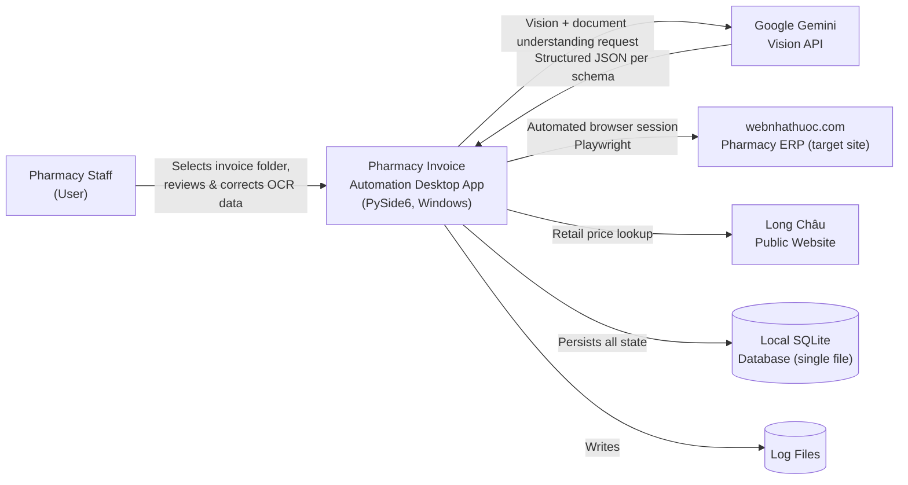
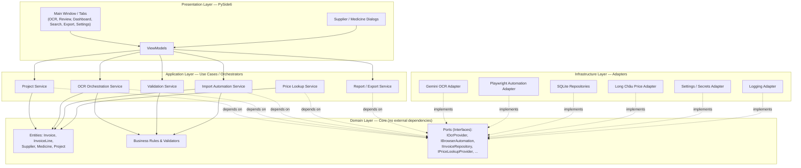
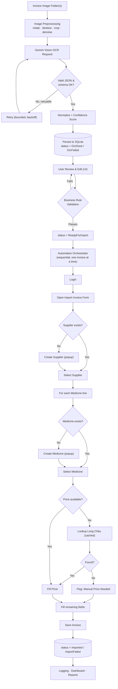
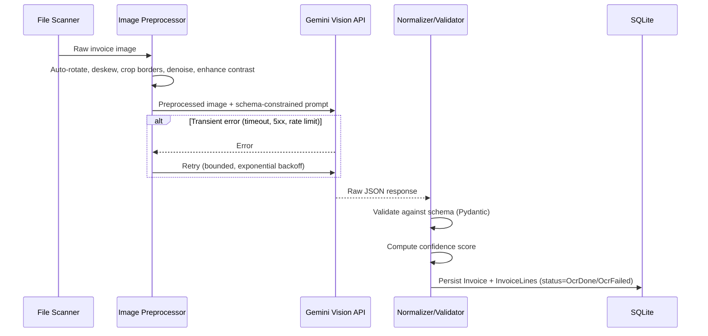
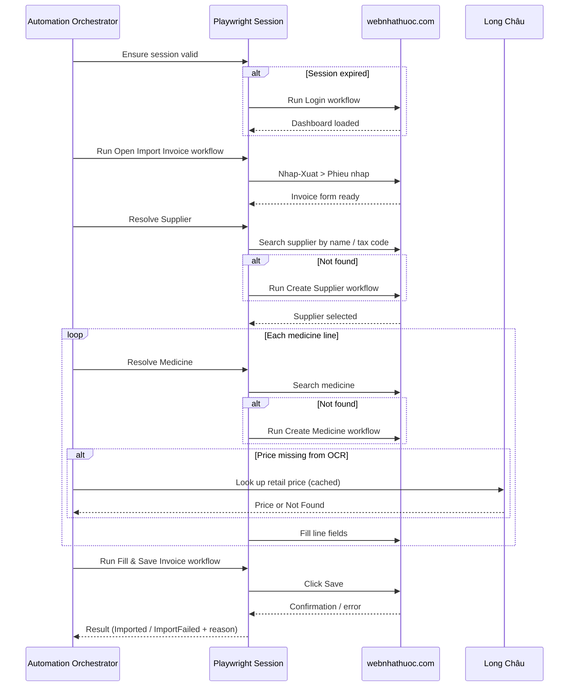
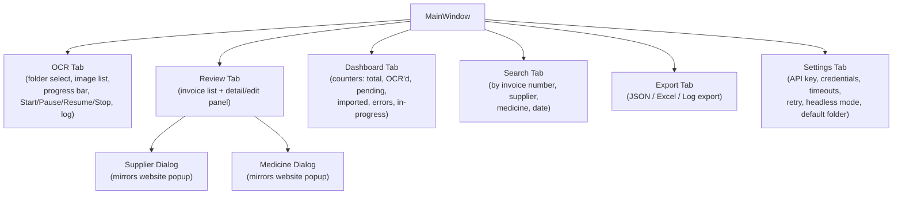
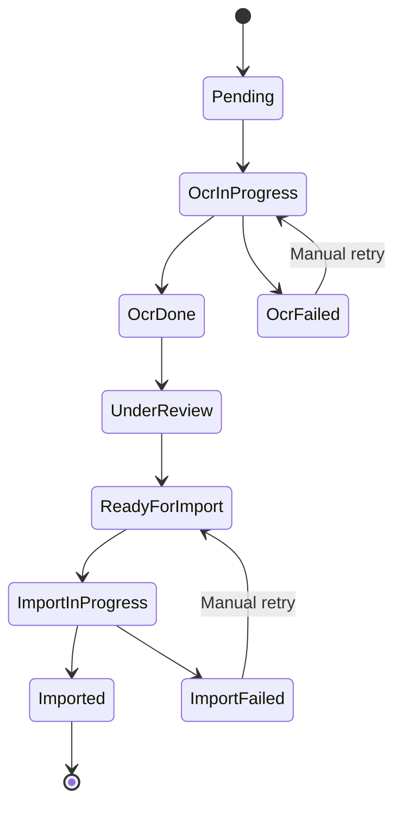
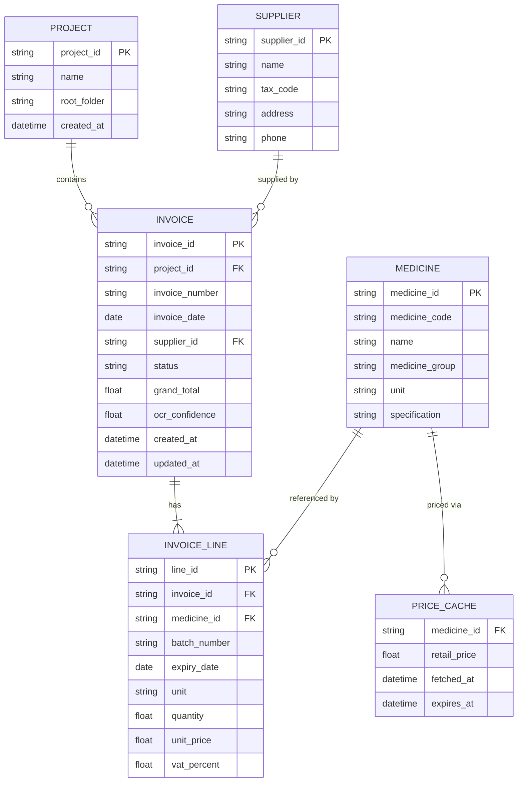

# Technical Design Document
# Pharmacy Purchase Invoice Automation System

## Document Control

| Field | Value |
|---|---|
| Project | Automated Import of Pharmacy Purchase Invoices into webnhathuoc.com |
| Phase | Architecture & Analysis — **no implementation code in this phase** |
| Prepared as | Principal Software Architect / AI Solution Architect / Senior OCR Engineer / Playwright Expert |
| Date | July 26, 2026 |
| Status | Draft v1.0 — Architecture Only |
| Source documents reviewed | README, Project Overview, Functional Requirements (FR-01–FR-16), Business Rules (x2), Technical Requirements, UI Requirements, Workflow specs (Login, Open Import Invoice, Create Supplier, Create Medicine), Naming Convention, Coding Rules |

## Table of Contents

1. Executive Summary
2. Overall System Architecture
3. Technology Stack
4. High-Level Modules
5. Folder Structure
6. Data Flow
7. OCR Architecture
8. Automation Architecture
9. Desktop UI Architecture
10. Configuration System
11. Logging Architecture
12. Database / Storage
13. Exception Handling Strategy
14. Performance Strategy
15. Security
16. Testing Strategy
17. Development Roadmap
18. Risks
19. Future Improvements
20. Final Review

---

## 1. Executive Summary

Pharmacy staff currently import each purchase invoice into the `webnhathuoc.com` management system by hand: reading a paper or photographed invoice, searching or creating the supplier, searching or creating every medicine line, and manually keying in quantities, prices, batch numbers and expiry dates. At several minutes per invoice, a batch of a few hundred invoices consumes multiple days of skilled labor and is a steady source of transcription error.

This project replaces that manual process with a **Windows desktop application** that:

1. Ingests **hundreds of invoice photographs** from one or more folders.
2. Uses **Google Gemini Vision** as a multimodal OCR and document-understanding engine to extract structured invoice data (supplier, medicines, quantities, prices, dates) into a validated JSON schema — never storing raw, unstructured OCR text.
3. Lets a pharmacist **review and correct** the extracted data in a native desktop UI before anything touches the live website.
4. Uses **Playwright** to drive the `webnhathuoc.com` browser session exactly the way a human would: log in, open the invoice import form, resolve suppliers and medicines (create if missing, select if existing), look up retail pricing on the Long Châu public site when needed, fill every field, and save.

The target outcome is to cut the effective time cost per invoice from several minutes to **under 20 seconds** of human attention (review + correction), while the automation absorbs the repetitive data-entry work, and to do so reliably across **batches of 100, 500, and 1,000+ invoices** without requiring the application to be restarted or data to be re-entered after an interruption.

### Key Architectural Decisions

- **Clean/Layered Architecture** (Domain → Application → Infrastructure/Presentation) so that OCR provider, automation engine, database, and UI framework can each change independently without touching business rules — a hard requirement given multi-year maintainability expectations.
- **Two-speed pipeline**: OCR runs **concurrently** (I/O-bound calls to Gemini, parallelizable), while website automation runs **strictly sequentially** through a single Playwright session (the website itself is a shared, stateful resource and must be driven the way a single human operator would).
- **SQLite as the single source of truth** for invoice state, enabling pause/resume, search, dashboarding, and reporting without re-processing completed work.
- **Every invoice is isolated**: a failure in OCR or automation for one invoice is logged and flagged, never silently skipped, and never blocks the rest of the batch — this is a hard business rule ("Không được bỏ qua hóa đơn — phải tiếp tục hóa đơn tiếp theo").
- **No hardcoded selectors** anywhere in the automation layer — all Playwright locators are externalized into a versioned Selector Registry so that a change on the website is a configuration update, not a code change.

### Explicit Non-Goals (this phase)

- No implementation code, classes, or scripts are produced in this document — architecture only, per instruction.
- No multi-tenant/cloud deployment is designed; this is a single-user Windows desktop application.
- No support for pharmacy systems other than `webnhathuoc.com` in v1 (extensibility for that is addressed in §19).

---

## 2. Overall System Architecture

### 2.1 System Context



The application is the single orchestrator between four external actors: the user, Gemini (OCR intelligence), the pharmacy ERP website (automation target), and Long Châu (a secondary read-only data source for retail pricing). All durable state lives locally in SQLite; nothing about invoice progress depends on any external system remaining reachable.

### 2.2 Layered (Clean) Architecture

The system is organized into four concentric layers. Dependencies only ever point **inward** — the Domain layer knows nothing about Gemini, Playwright, SQLite, or PySide6. This is what makes it possible to, for example, swap Gemini for another vision model, or Playwright for another automation engine, without touching business rules.



**Reading the diagram:** the Application layer only ever talks to *Ports* (abstract interfaces such as `IOcrProvider` or `IInvoiceRepository`) that are defined inside the Domain layer. The concrete Infrastructure adapters (Gemini, Playwright, SQLite, Long Châu, Settings, Logging) implement those ports. A **Composition Root** (the application's startup/bootstrap module) is the only place where concrete adapters are wired to the abstract ports — this is the sole point of dependency injection in the system, keeping every other module unaware of *which* concrete technology it is talking to.

### 2.3 Why This Shape

- **Testability**: every Application-layer service can be unit tested against fake/mock ports (fake OCR provider, fake browser automation) with zero network, zero browser, zero external cost.
- **Replaceability**: Gemini, Playwright, and SQLite are all "leaf" details behind interfaces — consistent with the explicit requirement for Repository Pattern, Service Pattern, SOLID, and Clean Architecture.
- **Two-speed execution model**: because OCR and Automation are separate Application services behind separate ports, they can run on different concurrency models (parallel async OCR vs. sequential single-session automation) without either one leaking its execution model into the other.
- **Fault isolation**: because every use case operates on one invoice at a time and persists state after each step, a crash anywhere does not corrupt already-completed work.

---

## 3. Technology Stack

| Technology | Role | Why Selected |
|---|---|---|
| **Python 3.12** | Primary language | Modern type-hint syntax (`X \| None`, generics), `match` statements for state-machine style logic, mature async support, required by project spec. |
| **PySide6** | Desktop UI framework | Native Qt bindings for Windows with a professional look, mature signal/slot model that maps cleanly onto MVVM and onto background-thread progress reporting, first-class dark-mode theming via QSS. |
| **Playwright (Python)** | Browser automation | Auto-waiting eliminates most flaky `sleep()`-based waits that plague Selenium; built-in tracing/video for debugging failed runs; robust handling of dynamic, JS-heavy pages; explicitly mandated over Selenium. |
| **Google Gemini Vision API** | OCR + document understanding | Multimodal model capable of reading Vietnamese handwriting/print, understanding tabular invoice layouts, and returning **structured JSON** directly (via response-schema-constrained generation) rather than raw text that a separate NLP step would have to parse. |
| **SQLite** | System-of-record persistence | Zero-config, single-file, transactional (ACID) database — ideal for a single-user desktop app; trivially backed up/copied; supports the exact query patterns needed for resume, search, and dashboarding. |
| **Pydantic** | Data validation & settings | Validates and normalizes the (sometimes imperfect) JSON that comes back from Gemini into strict domain-shaped models; also powers typed, validated application settings (`pydantic-settings`). |
| **OpenCV** | Image preprocessing | Auto-rotation, deskew, border cropping, denoising, contrast enhancement — all necessary to raise OCR accuracy on phone-photographed invoices before they ever reach Gemini. |
| **Pillow** | Image I/O | Lightweight format handling/conversion (JPG/PNG/future PDF-rendered pages) feeding into the OpenCV pipeline. |
| **httpx** | HTTP client | Async-capable client for calling the Gemini API (and any other REST endpoint) without blocking the OCR worker pool. |
| **python-dotenv** | Local dev configuration | Loads developer-machine environment variables (e.g., a dev Gemini key) without those values ever being committed to source control. |
| **Logging (stdlib) + rotating handlers** | Observability | Structured, timestamped, per-module logs as explicitly required (FR-10) with rotation/retention for long-running batches. |
| **Asyncio** | Concurrency | Drives the parallel OCR worker pool (I/O-bound Gemini calls) while the automation engine remains deliberately single-threaded/sequential. |
| **Repository Pattern / Service Pattern / SOLID / Clean Architecture** | Design discipline | Mandated in Technical Requirements; ensures the system is maintainable across years of website and model changes without rewrites. |
| **Type Hints throughout** | Static safety | Enables IDE assistance and static analysis (mypy-class tooling) across a codebase that will be maintained by more than one engineer over time. |

---

## 4. High-Level Modules

Each module below is described by **Responsibility**, **Inputs**, **Outputs**, and **Dependencies** (which, per the Clean Architecture rule in §2, only ever point inward toward Domain).

### 4.1 Domain Layer

| Module | Responsibility | Inputs | Outputs | Depends on |
|---|---|---|---|---|
| `domain.entities` | Define core business objects: `Project`, `Invoice`, `InvoiceLine`, `Supplier`, `Medicine`, along with value objects (`Money`, `TaxCode`, `ExpiryDate`, `Quantity`) and enums (`InvoiceStatus`, `MedicineGroup`, `UnitType`). | — (pure data + behavior) | In-memory domain objects | Nothing (innermost layer) |
| `domain.rules` | Encode business rules verbatim from the requirements: supplier resolution (exists → select, else → create), medicine resolution, prescription vs. OTC grouping, medicine code sequencing (`TH1`, `TH2`, …), unit mapping (`viên`/`tuýp`), duplicate detection, invoice-total consistency checks. | Domain entities | Validation results / derived values | `domain.entities` |
| `domain.ports` | Abstract interfaces the Application layer programs against: `IOcrProvider`, `IBrowserAutomation`, `IInvoiceRepository`, `ISupplierRepository`, `IMedicineRepository`, `IProjectRepository`, `IPriceLookupProvider`, `ISettingsProvider`, `ILogger`. | — | Contracts only | `domain.entities` |

### 4.2 Application Layer

| Module | Responsibility | Inputs | Outputs | Depends on |
|---|---|---|---|---|
| `application.project_service` | Create/open a Project, track its working folder(s) and overall progress; auto-save state (FR-01). | User folder selection | `Project` aggregate | `domain.ports` |
| `application.ocr_orchestration_service` | Feed the image queue to the OCR worker pool, persist each result immediately, drive retry/resume (FR-03, FR-15). | Image file list | Persisted `Invoice` records with status | `domain.ports` |
| `application.validation_service` | Run business-rule and cross-field validation on OCR output and user edits before allowing import (FR-05). | Draft `Invoice` | Pass/fail + list of issues | `domain.rules` |
| `application.import_automation_service` | Orchestrate the sequential website automation for each `ReadyForImport` invoice: login, supplier/medicine resolution, price lookup, fill, save (FR-06–FR-09). | Queue of `ReadyForImport` invoices | Updated invoice status, website confirmation | `domain.ports` |
| `application.price_lookup_service` | Resolve retail price for a medicine via Long Châu, with caching (FR-09). | Medicine name/spec | Price or "not found" flag | `domain.ports` |
| `application.report_export_service` | Aggregate dashboard counters, generate run reports, and export JSON/Excel/Log (FR-11, FR-13, FR-16). | Query filters | Files / in-memory report DTOs | `domain.ports` |

### 4.3 Infrastructure Layer (Adapters)

| Module | Responsibility | Inputs | Outputs | Depends on |
|---|---|---|---|---|
| `infrastructure.ocr.gemini_adapter` | Implements `IOcrProvider`: builds the Gemini request (image + schema-constrained prompt), parses/validates the JSON response, computes confidence, applies retry policy. | Preprocessed image | Normalized structured OCR result | Gemini SDK/httpx, `domain.ports` |
| `infrastructure.ocr.image_preprocessor` | Auto-rotate, deskew, crop borders, denoise, enhance contrast (OpenCV/Pillow) before OCR. | Raw image | Cleaned image | OpenCV, Pillow |
| `infrastructure.automation.playwright_adapter` | Implements `IBrowserAutomation`: browser/session lifecycle, all page interactions described in §8, popup/dialog handling, retries. | `Invoice` + `SelectorRegistry` | Success/failure + website-assigned confirmation | Playwright |
| `infrastructure.automation.selector_registry` | Externalized, versioned map of logical element names → Playwright locators for each target site (webnhathuoc.com, Long Châu). No selector is ever inline in automation code. | Config file | Locator lookups | — |
| `infrastructure.automation.price_scraper` | Implements `IPriceLookupProvider` against Long Châu. | Medicine name | Retail price or not-found | Playwright/httpx |
| `infrastructure.persistence.sqlite_repositories` | Implements every `I*Repository` port against SQLite: CRUD, search, dashboard aggregation queries. | Domain entities | Persisted rows / query results | SQLite driver |
| `infrastructure.config.settings_manager` | Implements `ISettingsProvider`: layered config (defaults → file → env → UI), encrypted secret storage. | `.env`, config file, UI input | Typed, validated `AppSettings` | Pydantic, keyring/Fernet |
| `infrastructure.logging.logger_factory` | Implements `ILogger`: per-category loggers, rotation, redaction, correlation IDs. | Log calls from any layer | Log files / console output | stdlib logging |

### 4.4 Presentation Layer

| Module | Responsibility | Inputs | Outputs | Depends on |
|---|---|---|---|---|
| `presentation.main_window` | Tab-based shell hosting OCR, Review, Dashboard, Search, Export, and Settings tabs. | User interaction | Rendered UI | `presentation.viewmodels` |
| `presentation.viewmodels` | MVVM bridge: expose Application-layer operations as Qt-signal-friendly, thread-safe view models. | UI events | Signals/slots, DTOs | `application.*` services |
| `presentation.dialogs` | Supplier-creation and medicine-creation popups that mirror the website's own popups, shown to the user for confirmation/preview before automation submits them. | User input | Domain-ready DTOs | `presentation.viewmodels` |
| `presentation.workers` | Background execution: an asyncio event loop (for OCR concurrency) and a dedicated automation thread, both bridged to the Qt main thread via signals so the UI never blocks. | Work items | Progress signals | `application.*` services |

### 4.5 Shared / Cross-Cutting

| Module | Responsibility |
|---|---|
| `shared.utils` | File-system scanning (recursive folder → image list), ID generation helpers, date/number parsing utilities shared across layers. |
| `shared.result` | A `Result`/`Outcome` type used across Application services so expected failure states (e.g., "supplier not found") are modeled as data, not exceptions (see §13). |

---

## 5. Folder Structure

The structure below follows the mandated Naming Convention (snake_case files/variables, PascalCase classes) and Clean Architecture layering. This is a **directory design**, not implementation code.

```
pharmacy_invoice_automation/
│
├── domain/                          # Innermost layer — no external dependencies
│   ├── entities/                    # Invoice, InvoiceLine, Supplier, Medicine, Project
│   ├── value_objects/               # Money, TaxCode, ExpiryDate, Quantity
│   ├── enums/                       # InvoiceStatus, MedicineGroup, UnitType
│   ├── rules/                       # Business rule validators (supplier/medicine
│   │                                #   resolution, code generation, unit mapping)
│   └── ports/                       # Abstract interfaces (IOcrProvider, IBrowserAutomation,
│                                    #   IInvoiceRepository, IPriceLookupProvider, ...)
│
├── application/                     # Use cases / orchestration services
│   ├── project_service/
│   ├── ocr_orchestration_service/
│   ├── validation_service/
│   ├── import_automation_service/
│   ├── price_lookup_service/
│   └── report_export_service/
│
├── infrastructure/                  # Concrete adapters implementing domain ports
│   ├── ocr/
│   │   ├── gemini_adapter/
│   │   ├── image_preprocessor/
│   │   └── prompt_templates/        # Versioned Gemini prompt + JSON schema definitions
│   ├── automation/
│   │   ├── playwright_adapter/
│   │   ├── selector_registry/       # Externalized locator configs (per target site)
│   │   ├── price_scraper/
│   │   └── session_store/           # Encrypted Playwright storage_state
│   ├── persistence/
│   │   ├── sqlite_repositories/
│   │   ├── migrations/              # Versioned schema migration scripts
│   │   └── unit_of_work/
│   ├── config/
│   │   ├── settings_manager/
│   │   └── secrets_manager/         # Keyring / Fernet-encrypted credential store
│   └── logging/
│       └── logger_factory/
│
├── presentation/                    # PySide6 desktop UI
│   ├── main_window/
│   ├── tabs/
│   │   ├── ocr_tab/
│   │   ├── review_tab/
│   │   ├── dashboard_tab/
│   │   ├── search_tab/
│   │   ├── export_tab/
│   │   └── settings_tab/
│   ├── dialogs/
│   │   ├── supplier_dialog/
│   │   └── medicine_dialog/
│   ├── viewmodels/
│   ├── workers/                     # Background thread / asyncio bridge
│   └── theme/                       # Dark-mode QSS stylesheets
│
├── shared/
│   ├── utils/
│   └── result/
│
├── tests/
│   ├── unit/                        # domain + application, fully mocked
│   ├── integration/                 # multi-layer, real SQLite, fake OCR/browser
│   ├── ocr_golden_files/            # sample invoices + expected normalized JSON
│   ├── automation_e2e/              # Playwright tests against staging/fixture HTML
│   └── fixtures/
│
├── config/
│   ├── app_settings.default.toml
│   ├── selector_registry.webnhathuoc.json
│   └── selector_registry.longchau.json
│
├── data/                            # Created at runtime, per-project
│   ├── project.sqlite3
│   └── logs/
│
├── docs/                            # This document and future ADRs
│
├── .env.example
└── pyproject.toml
```

Every module name is a full word (no abbreviations, per Naming Convention), every file will be `snake_case`, and every class defined inside these modules will be `PascalCase` when implementation begins.

---

## 6. Data Flow

The end-to-end flow extends the high-level workflow from the README (`Image → OCR → JSON → Review → Automation → Website`) with the validation, resume, and reporting stages required by the functional spec.

**Narrative:**

1. The user selects one or more folders; the app scans for `.jpg/.jpeg/.png` files (PDF reserved for a future phase per FR-02) and creates one `Invoice` record per image with status `Pending`.
2. The OCR Orchestration Service pulls `Pending` invoices into a bounded-concurrency worker pool. Each image is preprocessed (OpenCV), sent to Gemini with a schema-constrained prompt, and the response is normalized and confidence-scored.
3. Every OCR result — success or failure — is **persisted immediately** (FR-03): status becomes `OcrDone` or `OcrFailed`. Nothing is held only in memory.
4. The user reviews `OcrDone` invoices in the Review tab, correcting any field; every edit is saved immediately (FR-05). Low-confidence fields are visually flagged.
5. The Validation Service checks business rules (required fields present, dates sane, sum of line totals ≈ grand total, no duplicate invoice number/supplier/medicine) before allowing status to advance to `ReadyForImport`.
6. The Import Automation Service — running strictly one invoice at a time through a single Playwright session — logs in, opens the import form, resolves the supplier (search → select, or create via popup), resolves each medicine line the same way, looks up any missing retail price via Long Châu (with caching), fills every field, and saves.
7. The invoice becomes `Imported` or `ImportFailed`; either outcome is logged and reflected on the Dashboard immediately — the batch always proceeds to the next invoice.
8. The Dashboard, Search, Export, and Report features all read from the same persisted state, so counts are always accurate even if the app is closed and reopened mid-batch (FR-15).



---

## 7. OCR Architecture

### 7.1 Pipeline Overview



### 7.2 Image Preprocessing

Applied in a fixed order before every Gemini call, each step configurable/toggleable via settings:

1. **Auto-rotate** — correct EXIF-indicated or detected 90/180/270° rotation.
2. **Deskew** — correct small-angle tilt from handheld photography.
3. **Crop borders** — remove background/table/desk area outside the invoice sheet.
4. **Noise reduction** — reduce phone-camera sensor noise and JPEG artifacts.
5. **Contrast enhancement** — improve legibility of faint thermal-printer or carbon-copy text, common on pharmacy supplier invoices.

Preprocessing exists purely to raise Gemini's extraction accuracy; it never itself attempts field extraction.

### 7.3 Gemini Request & Prompt Design

- The prompt instructs Gemini to act as a Vietnamese pharmacy invoice extraction specialist and to return **only** a JSON object conforming to a fixed schema (using Gemini's structured-output/response-schema capability) — never free text, never markdown fences.
- The prompt explicitly enumerates every field the Business Rules require (see §7.4), including instructions for ambiguous cases: e.g., if the invoice text states explicitly whether a medicine is prescription (`Thuốc kê đơn`) or over-the-counter (`Thuốc không kê đơn`), extract that classification directly; if not stated, return it as unknown rather than guessing, so the Domain layer's classification rule (§7.5) can apply a documented fallback.
- The prompt requests a **per-field confidence indicator** in addition to raw values, used to drive the overall confidence score.
- Each invoice may contain a variable number of medicine line items; the schema defines `medicine_lines` as a repeatable array so Gemini is not constrained to a fixed row count.
- Prompts are versioned files under `infrastructure/ocr/prompt_templates/`, never inlined as string literals, so prompt-engineering iterations are tracked and testable independently of code changes.

### 7.4 Structured Output Schema (conceptual)

| Field | Type | Required | Notes |
|---|---|---|---|
| `invoice_number` | string | Yes | Used for duplicate detection. |
| `invoice_date` | date | Yes | Validated for plausibility (not in the future, not absurdly old). |
| `supplier.name` | string | Yes | |
| `supplier.tax_code` | string | No | Flagged if missing — required before automation can create a new supplier. |
| `supplier.address` | string | No | |
| `supplier.phone` | string | No | |
| `medicine_lines[].name` | string | Yes | |
| `medicine_lines[].medicine_code` | string | No | Supplier's own code, if printed; distinct from the system-generated `TH#` code. |
| `medicine_lines[].batch_number` | string | No | |
| `medicine_lines[].expiry_date` | date | No | Flagged if missing or implausible. |
| `medicine_lines[].unit` | string | Yes | Raw text as printed (e.g., "viên", "tuýp"); mapped to system units downstream. |
| `medicine_lines[].quantity` | number | Yes | |
| `medicine_lines[].purchase_price` | number | Yes | |
| `medicine_lines[].vat_percent` | number | No | |
| `medicine_lines[].line_total` | number | Yes | |
| `grand_total` | number | Yes | Cross-checked against the sum of line totals. |
| `prescription_classification` | enum / null | No | `prescription` / `otc` / `unknown` — see §7.5. |
| `field_confidences` | object | Yes | Per-field confidence, 0–1. |

### 7.5 Confidence Scoring & Validation

- **Model-reported confidence** (per field, from the prompt) is combined with **heuristic checks**:
  - Sum of `medicine_lines[].line_total` compared to `grand_total` within a small tolerance.
  - Date fields checked for calendar validity and reasonable range.
  - Required fields present.
- An **overall confidence score** is computed and stored per invoice; anything below a configurable threshold is visually flagged in the Review tab so the pharmacist's attention is directed to the invoices most likely to contain errors, rather than requiring uniform scrutiny of every invoice.
- **Prescription vs. OTC classification** (a Business Rule input, §3 of Business Rules doc): when Gemini extracts an explicit classification from the invoice text, that value is used directly. When the invoice does not state it, the Domain layer falls back to cross-referencing the medicine against previously classified medicines already in the local database; if still unresolved, the invoice is flagged for manual classification during review rather than guessed.
- **Duplicate detection**: invoice number, supplier, and medicine are each checked against existing records before allowing `ReadyForImport`, satisfying the explicit duplicate-invoice/supplier/medicine business rule.

### 7.6 Retry & Error Reporting

- Errors are classified **transient** (network timeout, 5xx, rate limit) vs. **permanent** (malformed image, content-policy rejection, invalid API key).
- Transient errors are retried with exponential backoff up to a configurable maximum attempt count (FR-14 setting).
- Permanent errors mark the invoice `OcrFailed` immediately, with the specific reason logged and surfaced in the UI — the batch always continues to the next image (this mirrors the same "never skip silently, always continue" rule that governs automation failures).
- A `OcrFailed` invoice can be manually retried from the Review tab at any time, re-entering the pipeline at step 2 without re-scanning the folder.

---

## 8. Automation Architecture

### 8.1 Browser Lifecycle & Session Management

- A **single, long-lived Playwright browser context** is used for the duration of a batch run, rather than launching a fresh browser per invoice — this mirrors realistic human usage, minimizes login overhead, and avoids drawing unnecessary attention from any anti-automation heuristics the site may have.
- The authenticated session (`storage_state`) is persisted to an **encrypted** local file (see §15) so that, if the app is restarted mid-batch, it can attempt to resume the existing session before falling back to a fresh login.
- Before every invoice, the orchestrator verifies the session is still valid (e.g., a lightweight check for a known "logged-in" UI marker). If the session has expired, the Login workflow (§8.4) is re-run automatically and logged.
- If the browser process crashes outright, the Automation Adapter detects the dead connection, tears down and relaunches the browser/context, restores session state, and **resumes from the last invoice that had not reached a terminal status** (`Imported` or `ImportFailed`) — it never restarts the whole batch.

### 8.2 Selector Strategy — "No Hardcoded Selectors"

Per Coding Rules ("Không hardcode selector"), all Playwright locators live in an external, versioned **Selector Registry** (one file per target site: `webnhathuoc.com`, Long Châu), keyed by a logical, human-readable element name (e.g., `login.username_field`, `invoice_form.add_supplier_button`) rather than embedded in automation logic.

- **Locator preference order**: role/text-based locators first (most resilient to visual restyling), then stable `id`/`data-*` attributes if present, then structural CSS only as a last resort.
- A locator's *logical name* is stable even if its underlying strategy changes — so a site redesign is addressed by updating one registry entry, not by touching orchestration logic.
- A periodic **smoke test** (§16) exercises every registry entry against the live site to detect breakage as early as possible, ahead of a full batch run failing partway through.

### 8.3 Wait Strategy & Popup Handling

- Playwright's built-in auto-waiting (for element visibility/actionability) is the default; **no arbitrary fixed `sleep`** is used.
- Explicit waits are added only for known asynchronous indicators (e.g., a loading spinner disappearing, a popup's closing animation completing).
- A registered set of **handlers for unexpected interruptions** runs alongside every workflow: session-expired dialogs, validation-error toasts, native browser dialogs (alert/confirm), and unexpected modals — each mapped to a recovery action (re-login, surface the validation message to the user, dismiss and retry) rather than being allowed to silently stall the automation.

### 8.4 Workflow Implementations

Each workflow below maps directly to the corresponding workflow specification document, expressed here as a designed automation flow (no code):

| Workflow | Start State | Steps (design intent) | End State |
|---|---|---|---|
| **Login** | Login page | Fill username → fill password → click "Đăng nhập" → wait for Dashboard marker | Dashboard |
| **Open Import Invoice** | Dashboard | Open "Nhập - Xuất" menu → select "Phiếu nhập" → wait for invoice form to be interactive | Invoice import form |
| **Create Supplier** | Invoice form | Click "+" → wait for Supplier popup → fill Name / Address / Phone / Tax Code → click "Thêm mới" → wait for popup close → verify supplier now selected on the invoice | Supplier selected on invoice |
| **Create Medicine** | Invoice form | Click "+" in the Mặt hàng (Items) section → wait for Medicine popup → select Nhóm thuốc (group) and Loại hàng (item type) → fill Mã thuốc / Tên thuốc / Đơn vị / Quy cách → click "Thêm mới" → wait for popup close → verify medicine now appears in the item list | Medicine available for selection |
| **Fill & Save Invoice** | Invoice form with supplier + all medicine lines resolved | Fill remaining header fields (invoice number, date) and per-line fields (quantity, unit price, batch, expiry, unit) → click Save → wait for save confirmation | Invoice saved on website |

### 8.5 End-to-End Automation Sequence



### 8.6 Resilience Requirements Coverage

| Requirement | Design Response |
|---|---|
| Slow network | Explicit, configurable navigation/action timeouts; retry policy on transient failures. |
| Popups | Registered popup/dialog handlers (§8.3). |
| Loading states | Wait on known loading indicators in addition to Playwright auto-wait. |
| Expired session | Session-validity check before every invoice; automatic re-login. |
| Unexpected dialog | Global dialog handler with logging and safe-default dismissal. |
| Dynamic page | Role/text-based locators (§8.2), resilient to layout-only changes. |
| Retry | Per-action retry wrapper with backoff, distinguishing retryable vs. non-retryable failures (detailed in §13). |

---

## 9. Desktop UI Architecture

### 9.1 Window Hierarchy & Navigation

The application is a single `MainWindow` hosting a tabbed workspace, matching the UI Requirements and covering every functional area:



### 9.2 MVVM Pattern

- **Views** (`QWidget` subclasses) contain no business logic; they bind to **ViewModels** via Qt signals/slots.
- **ViewModels** translate UI events into calls on Application-layer services and translate service results/DTOs back into UI-bindable state, emitting Qt signals when that state changes (new OCR result available, dashboard counters updated, etc.).
- This keeps every Application service **framework-agnostic** — the same services could in principle back a different UI technology without modification.

### 9.3 State Management & Cross-Tab Updates

- A lightweight in-process **event bus** propagates domain-level events (e.g., `InvoiceOcrCompleted`, `InvoiceImported`, `InvoiceFailed`) to any interested ViewModel, so the Dashboard tab updates live while OCR or automation runs on the OCR tab, without tight coupling between tabs.
- Long-running work (OCR batch, automation batch) executes on background execution contexts (an asyncio loop for OCR concurrency, a dedicated thread for the sequential automation session) and reports progress back to the Qt main thread exclusively via signals — the UI thread is never blocked and never touches Playwright or Gemini directly.

### 9.4 Key Components

| Component | Purpose |
|---|---|
| Image thumbnail list | Shows every discovered invoice image with a status badge (Pending / OCR Done / Failed / Imported). |
| Invoice detail/edit panel | Displays full OCR output (FR-04) and allows correction of every editable field (FR-05), saving immediately on change. |
| Progress bar + Start/Pause/Resume/Stop | Drives and reflects both the OCR batch and the automation batch; Pause/Resume/Stop map onto cooperative cancellation points in the background workers, never a hard kill that could corrupt in-flight state. |
| Log console widget | Live tail of the structured log stream (§11), filterable by category (OCR, Automation, Database, Error). |
| Dashboard cards | Live counters matching FR-11. |
| Settings form | Secure input for credentials/API key (masked fields), validated before save. |

### 9.5 Theming

Dark mode is the preferred default, implemented via a QSS stylesheet applied at application startup, with theme values (colors, spacing) centralized so a future light theme is a stylesheet swap, not a UI rewrite.

---

## 10. Configuration System

### 10.1 Layered Configuration

Settings are resolved in increasing priority order:

1. **Built-in defaults** (shipped with the application).
2. **Config file** (`config/app_settings.default.toml`) for environment-level defaults.
3. **Environment variables** (via `python-dotenv` in development).
4. **User-set values via the Settings Tab**, persisted and taking precedence thereafter.

All settings are modeled as a typed, validated Pydantic settings object — invalid values (e.g., a negative timeout) are rejected at the boundary rather than surfacing as a runtime failure deep in the automation flow.

### 10.2 Configurable Settings (mapped to FR-14, plus additions identified during architecture)

| Setting | Source of Requirement |
|---|---|
| Gemini API Key | FR-14 (stored via Secrets Manager, §15, never in plain config) |
| Website Username / Password | FR-14 (stored via Secrets Manager, §15) |
| Headless Mode (on/off) | FR-14 |
| Timeout (navigation, action, API call) | FR-14 |
| Retry count (OCR, automation, price lookup) | FR-14 |
| Default working folder | FR-14 |
| Gemini model identifier/version | Identified — pins the exact model version used, since Gemini model naming evolves. |
| OCR concurrency limit | Identified — bounds parallel Gemini calls to respect API quota/rate limits. |
| Price cache TTL | Identified — controls how long a Long Châu price lookup is trusted before re-fetching. |
| Log level & retention days | Identified — operational tuning without a code change. |

### 10.3 Secrets Handling

Sensitive settings (API key, website credentials) are **never** written to the plain settings file; they are routed through the Secrets Manager (see §15) and only a reference/placeholder is stored in the visible configuration.

---

## 11. Logging Architecture

### 11.1 Structure

All logging flows through a single `logger_factory`, producing **per-category child loggers** under a root `pharmacy_automation` namespace, directly mirroring the categories required by FR-10:

- `pharmacy_automation.ocr`
- `pharmacy_automation.gemini_api`
- `pharmacy_automation.automation`
- `pharmacy_automation.database`
- `pharmacy_automation.error`
- `pharmacy_automation.retry`

Every log entry carries: **timestamp**, **level**, **category**, and a **correlation ID** (the `invoice_id`, where applicable) so a single invoice's journey through preprocessing → OCR → validation → automation → save can be reconstructed from the log stream alone — essential for diagnosing any one failed invoice out of a batch of a thousand.

### 11.2 Sinks

- **Rotating file logs** (size- or day-based rotation, retention governed by the Settings module) as the durable record.
- **Console logging** for development.
| **Log console widget** in the UI tails the same stream live (§9.4).

### 11.3 Redaction

A logging filter strips or masks any field known to be sensitive (API keys, passwords, session tokens) **before** a record is ever written to any sink — this is enforced centrally in `logger_factory`, not left to the discipline of each call site.

### 11.4 Performance Logging

Elapsed time is captured per invoice and per pipeline stage (preprocessing, OCR call, validation, automation), feeding directly into the Report/Export Service (§4.2, FR-16) for "total processing time" and "average time per invoice" metrics.

---

## 12. Database / Storage

### 12.1 Should SQLite Be Used? — **Yes.**

SQLite is the **system of record** for all invoice, supplier, and medicine state. It is the only component that makes FR-01 (resume after close), FR-11 (dashboard), FR-12 (search), FR-15 (resume without redoing work), and FR-16 (reports) possible, because all of those features require durable, queryable state that survives an application restart.

### 12.2 Should JSON Be Used? — **Only transiently, never as the source of truth.**

Raw Gemini JSON is parsed and immediately normalized into relational rows (FR-03 explicitly states raw text must not be the persisted form). JSON re-appears only as an **export format** (FR-13) generated on demand from the database — it is a projection of the data, never the storage mechanism itself.

### 12.3 Should a Cache Exist? — **Yes, for retail price lookups.**

Long Châu price lookups are cached (`price_cache` table, §12.5) with a configurable TTL (§10.2). This avoids re-scraping Long Châu for a medicine already priced recently, which both speeds up batch processing and reduces load/attention on a third-party site.

### 12.4 Invoice State Machine



Only `Imported` is terminal in the "never touch again" sense that FR-15 requires ("không nhập lại hóa đơn đã hoàn thành"); every other non-terminal state is safely re-enterable, which is what makes pause/resume/stop reliable.

### 12.5 Schema (Conceptual Entity–Relationship Design)



Additional supporting tables (not shown as entities above since they are operational rather than business data): `settings` (encrypted key/value blobs), `run_history` (one row per batch run, feeding FR-16 reports), `logs` remain file-based (§11) rather than in SQLite, to avoid write contention between high-frequency logging and business-data transactions.

### 12.6 Indexing for Search (FR-12)

Indexes are placed on `invoice.invoice_number`, `invoice.invoice_date`, `supplier.name`, and `medicine.name` — the four fields FR-12 requires searching by — so that search remains responsive even at 1,000+ invoices.

### 12.7 Migrations

Schema changes are applied through versioned migration scripts run automatically at application startup, each tagged with a monotonically increasing version number recorded in the database itself, so an upgrade never silently skips a schema change and never re-applies one.

---

## 13. Exception Handling Strategy

### 13.1 Layered Handling Philosophy

- **Domain layer** raises specific, named domain exceptions only for truly exceptional conditions (e.g., an invariant violation). Expected "failure" outcomes — such as "supplier not found" — are modeled as **data** (a `Result`/`Outcome` type, per §4.5), not as exceptions, so calling code reacts with ordinary conditional logic rather than exception-driven control flow.
- **Application layer** consumes those `Result` types and translates infrastructure-level errors into a small set of well-defined Application-level failure categories (e.g., `OcrFailure`, `AutomationFailure`, `ValidationFailure`) that the Presentation layer knows how to render.
- **Infrastructure layer** wraps every external error (Gemini API error, Playwright timeout, SQLite error) with enough context (which invoice, which step, which underlying cause) before it crosses back into the Application layer — no bare, unannotated exception is ever allowed to propagate upward.
- A **global exception handler** at the Composition Root catches anything unhandled, logs it with full context, and converts it into a non-fatal UI notification — the application itself must never crash outright due to a single invoice's failure.

### 13.2 Retry Policy

| Dimension | Design |
|---|---|
| Classification | Every error is classified **retryable** (timeout, 5xx, transient network failure, temporary UI-state mismatch) or **non-retryable** (validation failure, authentication failure, malformed/rejected input). |
| Backoff | Exponential backoff between attempts, with a configurable maximum attempt count per operation type (OCR call, browser action, price lookup) — set independently in Settings (§10.2), since Gemini calls, browser actions, and HTTP price lookups have different natural latencies and failure profiles. |
| Scope | Retries are always scoped to the smallest safe unit of work (a single Gemini call, a single browser action) — never to "restart the whole invoice from scratch" unless the smaller-scope retries are themselves exhausted. |

### 13.3 Timeout Policy

Explicit, independently configurable timeouts exist for: Gemini API calls, Playwright navigation, Playwright individual actions, and SQLite operations. No operation waits indefinitely.

### 13.4 Recovery & Isolation

- **Per-invoice isolation** is the central resilience principle of the whole system: a failure at any stage marks that one invoice `OcrFailed` or `ImportFailed`, logs the specific cause, and the orchestrator immediately proceeds to the next invoice in the queue. This directly implements the Business Rule "Không được bỏ qua hóa đơn — Phải tiếp tục hóa đơn tiếp theo" (never skip an invoice silently — always continue to the next), interpreted as: **never skip invisibly; always mark and continue.**
- **Browser crash recovery**: the Automation Adapter detects a dead browser/context, relaunches it, restores the session, and resumes from the oldest non-terminal invoice — no manual intervention required to continue an interrupted batch.
- **OCR failure recovery**: handled entirely by the retry policy above; if retries are exhausted, the invoice is flagged for manual re-run from the Review tab.

---

## 14. Performance Strategy

### 14.1 Two-Speed Concurrency Model

- **OCR stage — parallel.** OCR calls are I/O-bound and independent per invoice, so they run through an `asyncio`-based worker pool with a **bounded concurrency limit** (configurable, §10.2) chosen to respect Gemini's rate/quota limits while maximizing throughput.
- **Automation stage — strictly sequential.** A single Playwright session processes one invoice at a time. This is a deliberate design choice, not a limitation: the target website is a shared, stateful resource, and driving it as multiple simultaneous "users" would both risk data races on the site itself and look anomalous to any bot-detection heuristics. Because OCR runs ahead of automation, the sequential automation stage is rarely the bottleneck for total wall-clock time as long as OCR keeps a healthy backlog of `ReadyForImport` invoices available.

### 14.2 Work Queues

An internal queue structure decouples the two stages: `Pending` invoices feed the OCR pool; `ReadyForImport` invoices feed the automation worker. This means OCR can run well ahead of automation (or the user can review at their own pace) without either stage blocking the other.

### 14.3 Memory Management

- Images are loaded, preprocessed, sent, and released one at a time — the full image set for a 1,000-invoice batch is never held in memory simultaneously.
- UI lists use virtualized/lazily-rendered widgets so a 1,000-row invoice list does not degrade UI responsiveness.

### 14.4 Batching & Checkpointing

Processing proceeds in chunks with periodic commits to SQLite rather than one large transaction spanning the whole batch — this bounds both memory and the amount of work at risk if the process is interrupted.

### 14.5 UI Responsiveness

All OCR and automation work executes off the Qt main thread; the UI thread only ever receives lightweight progress signals, keeping the interface responsive even while processing hundreds of invoices in the background.

---

## 15. Security

### 15.1 Credential & API Key Storage

- The Gemini API key and the `webnhathuoc.com` username/password are **never** stored in plain text in any config file or in the SQLite database.
- Primary storage mechanism: the OS-level secure credential store (Windows Credential Manager, accessed via a `keyring`-style abstraction), so secrets are protected by the operating system itself.
- Fallback mechanism (if OS-level storage is unavailable): a locally encrypted file (symmetric encryption, key derived from machine-bound entropy), never checked into source control and never exported.
- The Settings Tab masks password/API-key fields in the UI at all times.

### 15.2 Session Data

Playwright's `storage_state` (effectively a bearer credential — session cookies) is treated with the same sensitivity as the plaintext password and is encrypted at rest using the same Secrets Manager.

### 15.3 Logging & Export Hygiene

- The redaction filter described in §11.3 guarantees no secret ever reaches a log file.
- The Export Service (§4.2, FR-13) scrubs any credential-adjacent field before writing JSON/Excel exports — exported files are safe to share with a pharmacist or auditor without exposing system credentials.

### 15.4 Network Scope

The application's network activity is deliberately narrow: Gemini API, `webnhathuoc.com`, and Long Châu (read-only). No other outbound network access is designed into the system, minimizing the attack surface and making anomalous network activity easy to notice.

### 15.5 Data-at-Rest

Business data (supplier details, medicine catalogs, invoice contents) lives in a single local SQLite file. Because pharmacy purchasing data can be commercially sensitive, encrypting the database file at rest (or relying on Windows disk/volume encryption such as BitLocker on the deployment machine) is recommended as an operational practice alongside the application-level secret handling above.

### 15.6 Dependency Hygiene

Playwright browser binaries, the Gemini SDK, and other third-party dependencies should be kept on a documented update cadence — automation reliability and security both benefit from not running stale browser engines against an evolving live website.

---

## 16. Testing Strategy

| Test Layer | Scope | Approach |
|---|---|---|
| **Unit tests** (Domain) | Business rules: medicine code generation (`TH1`, `TH2`, …), unit mapping (`viên` → viên, `tuýp` → tuýp), prescription/OTC classification fallback, duplicate detection, total-consistency validation. | Pure, dependency-free tests — fast, run on every commit, satisfy the explicit "Có unit test" coding rule. |
| **Unit tests** (Application) | Orchestration logic: retry behavior, resume behavior, per-invoice failure isolation. | Exercised against **fake ports** (`FakeOcrProvider`, `FakeInvoiceRepository`, `FakeBrowserAutomation`) — no real network, no real browser, no real cost. |
| **OCR golden-file tests** | Correctness of the full preprocessing → Gemini → normalization pipeline. | A curated set of representative sample invoices (clean, skewed, low-quality/handwritten, multi-line) with hand-verified expected normalized JSON; any drift in output is caught automatically. Also serves as a **prompt-regression** safety net when prompt templates are revised. |
| **Automation tests** | Correctness and resilience of each Playwright workflow (Login, Open Import Invoice, Create Supplier, Create Medicine, Fill & Save). | Run against a staging environment where available, and/or against recorded HTML fixtures for faster, non-live-dependent test runs. |
| **Selector smoke tests** | Ongoing validity of every Selector Registry entry against the live site. | Scheduled (e.g., nightly) run that resolves every registered locator and reports breakage **before** a full production batch run encounters it. |
| **Integration tests** | End-to-end pipeline correctness across a small, controlled invoice set. | Real SQLite, real (small) OCR/automation runs in a sandboxed test project directory. |
| **UI tests** | Widget-level behavior: Start/Pause/Resume/Stop state transitions, form validation feedback, dark-mode rendering. | `pytest-qt`–style widget testing. |

**Test data management**: a dedicated fixtures directory holds anonymized/sample invoice images alongside their expected normalized JSON outputs, versioned alongside the code so regressions are caught deterministically.

**Recommended cadence**: unit + Application + OCR golden-file tests run on every commit (fast, free, no external dependency); automation/E2E and selector smoke tests run less frequently (e.g., nightly) given their cost and inherent fragility against a live third-party site.

---

## 17. Development Roadmap

| Phase | Focus | Exit Criteria |
|---|---|---|
| **Phase 0 — Architecture** *(this document)* | Full design: layers, modules, data flow, schema, roadmap. | Architecture reviewed and approved; no code written. |
| **Phase 1 — Foundation** | Domain entities/value objects/enums; Application service interfaces (ports); SQLite schema + migrations; Settings & Secrets management; Logging framework skeleton. | Domain and persistence layers pass unit tests with no OCR/automation/UI dependency yet. |
| **Phase 2 — OCR Pipeline** | Image preprocessing; Gemini adapter; prompt templates + JSON schema; normalization; confidence scoring; retry policy. Validated at the pipeline level (CLI/test harness) before any UI exists. | OCR golden-file tests pass on the curated sample invoice set at an acceptable accuracy threshold. |
| **Phase 3 — Desktop UI Shell** | Main window, tab navigation, OCR tab, Review tab wired to the Phase 2 pipeline via ViewModels. | A user can select a folder, run OCR, and review/edit results end-to-end, with all state persisted. |
| **Phase 4 — Automation Engine** | Selector Registry; Playwright adapter; Login, Open Import Invoice, Create Supplier, Create Medicine, Fill & Save workflows; session management. | Each workflow independently validated against a staging environment. |
| **Phase 5 — Full Pipeline Integration** | Wire Review → Validation → Automation end-to-end; Dashboard tab; Pause/Resume/Stop; resume-after-restart (FR-15). | A full batch (e.g., 20–50 invoices) processes from image to saved website invoice without manual intervention beyond review. |
| **Phase 6 — Price Lookup, Export & Reporting** | Long Châu price lookup + caching; Export (JSON/Excel/Log); Search tab; Report generation (FR-16). | All FR-09, FR-12, FR-13, FR-16 requirements demonstrably satisfied. |
| **Phase 7 — Hardening** | Exhaustive error-handling paths; retry/timeout tuning; performance tuning at 500–1,000+ invoice scale; security review of secrets handling. | Batch of 1,000 sample invoices completes with all failures isolated, logged, and recoverable; no crashes. |
| **Phase 8 — Pilot & UAT** | Real-world pilot on a genuine invoice subset with actual pharmacy staff. | Sign-off from pharmacy staff on accuracy and time savings; selector registry validated against the true production site. |
| **Phase 9 — Production Rollout** | Full deployment; monitoring of logs/reports in real usage; establish the dependency-update and selector-maintenance cadence from §15.6/§16. | Application in daily use processing the full invoice volume. |

---

## 18. Risks

| Risk | Impact | Likelihood | Mitigation |
|---|---|---|---|
| OCR accuracy on poor-quality photos (blur, low light, handwriting) | Incorrect data silently entered on the website | Medium | Preprocessing pipeline (§7.2); per-field confidence flagging directs review attention (§7.5); mandatory human review before any automation runs. |
| Website UI changes break automation | Automation fails mid-batch | Medium–High (external site not controlled by this project) | Externalized Selector Registry (§8.2); scheduled selector smoke tests (§16) catch breakage before a production batch run. |
| Session expiry / anti-automation detection | Automation blocked or logged out mid-batch | Medium | Long-lived single session mimicking human usage (§8.1); automatic session-validity check and re-login; conservative, human-paced sequential automation (never parallel browser sessions against the live site). |
| Gemini / Long Châu rate limiting | Slower throughput or failed batches | Low–Medium | Configurable concurrency limit (§14.1); retry with backoff (§13.2); price caching (§12.3) reduces Long Châu call volume. |
| Duplicate supplier/medicine/invoice creation | Data pollution in the pharmacy ERP | Medium | Explicit duplicate-detection validation gate before `ReadyForImport` (§7.5). |
| Reliability degradation at 500–1,000+ invoice scale | Slower processing, memory pressure, or missed edge cases | Medium | Streamed image handling, chunked/checkpointed processing (§14.3–14.4); dedicated Phase 7 hardening and load testing at scale. |
| Data loss on crash or power loss | Re-work, lost review edits | Low | Immediate persistence after every OCR result and every user edit (FR-03, FR-05); durable SQLite transactions. |
| Concurrency conflicts between the OCR worker pool and the automation worker reading/writing the same database | Race conditions on invoice state | Low | Clear queue separation by status (§14.2); repository-level transactional writes; single-writer discipline per status transition. |
| Long Châu / target-site Terms of Service considerations for automated access | Legal/compliance exposure | Unknown — depends on the sites' terms | Flag explicitly for business/legal sign-off before production rollout; keep automation human-paced and read-only against Long Châu. |
| Playwright/browser binary or Gemini SDK drift over time | Silent breakage after an unrelated update | Low–Medium | Documented dependency-update cadence (§15.6); regression test suite run after any dependency bump. |

---

## 19. Future Improvements

- **Multi-pharmacy-system support**: the Automation Adapter and Selector Registry are already designed behind an `IBrowserAutomation` port (§2, §4.3); a second pharmacy website could be added as a new adapter + registry file without touching Domain or Application logic.
- **Offline/local OCR fallback**: an alternative `IOcrProvider` implementation using an open-source or on-device Vietnamese OCR model, useful during a Gemini outage or to reduce per-invoice API cost at very high volumes.
- **Additional pricing sources**: `IPriceLookupProvider` could be extended to check multiple supplier/retail price sources beyond Long Châu, with a defined priority order.
- **Cloud sync / multi-user**: today's single-file SQLite design is intentionally single-user; a future phase could layer a sync mechanism or migrate to a client-server database if multiple pharmacists need to work the same batch concurrently.
- **Folder-watching / continuous ingestion**: automatically pick up new invoice images dropped into a watched folder rather than requiring an explicit "select folder" action each session.
- **ML-assisted prescription/OTC classification**: if invoices frequently omit an explicit classification, a learned classifier trained on the growing local medicine catalog could reduce manual classification flags over time.
- **Mobile capture companion**: a lightweight mobile app for photographing invoices directly into the ingestion folder, reducing the desktop-only bottleneck of gathering images first.
- **Analytics/trend dashboard**: longer-term reporting (supplier spend trends, medicine price trends over time using the `price_cache` history) built on top of the existing `run_history` and reporting tables.

---

## 20. Final Review

The proposed architecture is well-suited to the stated goal: reliably importing hundreds to thousands of pharmacy purchase invoices with minimal manual effort. Its suitability rests on four properties, each traceable to a specific design decision above:

1. **Reliability at scale** is achieved not by any single "silver bullet" component, but by the combination of per-invoice state persistence (§12), per-invoice failure isolation (§13.4), and a resume-capable state machine (§12.4) — a batch of 1,000 invoices can be paused, interrupted by a crash, or partially failed, and always continues from exactly where it left off, never redoing completed work and never silently dropping a failed one.
2. **Maintainability over a multi-year lifespan** is achieved by the Clean/layered architecture (§2) and the explicit externalization of the two most volatile dependencies — the OCR provider and the website's UI — behind ports and a Selector Registry (§8.2), so that a Gemini API change or a `webnhathuoc.com` redesign is a localized, configuration-or-adapter-level change rather than a system-wide rewrite.
3. **Correctness under real-world data quality** is addressed by the preprocessing → confidence scoring → mandatory human review pipeline (§7), which acknowledges upfront that OCR on photographed invoices will never be perfect, and designs the human review step as a first-class stage rather than an afterthought.
4. **Operational safety** is addressed through the security design (§15) and the human-paced, single-session automation model (§8.1, §14.1), which minimizes the chance of the automation appearing anomalous to the target website while keeping credentials and session data protected at rest.

**Conditions and caveats for a confident yes**: performance at the 1,000+ invoice tier should be validated empirically during Phase 7 hardening (concurrency and Gemini quota tuning are configuration, not architecture, but they do need real measurement); website automation is, by nature, coupled to a system this project does not control, so the ongoing selector-maintenance practice (§16 smoke tests) is not optional polish but a required operational habit, not a one-time build step; and a short pilot phase (Phase 8) against real invoices and the real production site is strongly recommended before full rollout, since no amount of architecture review substitutes for validating OCR accuracy and selector stability against genuine, messy, real-world invoice photographs.

With those caveats accounted for in the roadmap, **this architecture is suitable and recommended for implementation.**

---

*End of Technical Design Document.*
